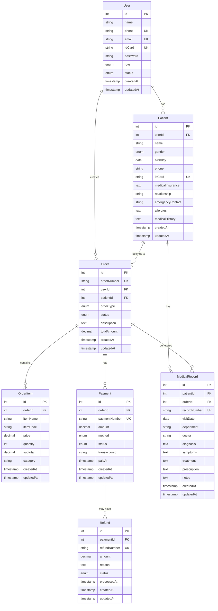

# 数据库设计说明

## 概述

本文档描述了医疗系统后端服务的数据库设计，包括表结构、字段定义、索引设计和关系说明。

## 数据库选型

- **数据库类型**: PostgreSQL 13+
- **ORM框架**: Prisma
- **字符集**: UTF-8
- **时区**: UTC

## 数据表设计

### 1. 用户表 (User)

存储系统用户的基本信息和认证数据。

| 字段名 | 数据类型 | 长度 | 约束 | 默认值 | 描述 |
|--------|----------|------|------|--------|---------|
| id | SERIAL | - | PRIMARY KEY | - | 用户ID，自增主键 |
| name | VARCHAR | 50 | NOT NULL | - | 用户姓名 |
| phone | VARCHAR | 11 | UNIQUE, NOT NULL | - | 手机号，唯一 |
| email | VARCHAR | 100 | UNIQUE, NOT NULL | - | 邮箱地址，唯一 |
| idCard | VARCHAR | 18 | UNIQUE, NOT NULL | - | 身份证号，唯一 |
| password | VARCHAR | 255 | NOT NULL | - | 密码（bcrypt加密） |
| role | ENUM | - | NOT NULL | USER | 用户角色 |
| status | ENUM | - | NOT NULL | ACTIVE | 用户状态 |
| createdAt | TIMESTAMP | - | NOT NULL | NOW() | 创建时间 |
| updatedAt | TIMESTAMP | - | NOT NULL | NOW() | 更新时间 |

**枚举值定义:**
- `role`: ADMIN（管理员）, USER（普通用户）
- `status`: ACTIVE（激活）, INACTIVE（禁用）

**索引设计:**
- PRIMARY KEY: `id`
- UNIQUE INDEX: `phone`, `email`, `idCard`
- INDEX: `role`, `status`, `createdAt`

### 2. 就诊人表 (Patient)

存储用户的就诊人信息，一个用户可以有多个就诊人。

| 字段名 | 数据类型 | 长度 | 约束 | 默认值 | 描述 |
|--------|----------|------|------|--------|---------|
| id | SERIAL | - | PRIMARY KEY | - | 就诊人ID，自增主键 |
| userId | INTEGER | - | NOT NULL, FK | - | 用户ID，外键 |
| name | VARCHAR | 50 | NOT NULL | - | 就诊人姓名 |
| gender | ENUM | - | NOT NULL | - | 性别 |
| birthday | DATE | - | NOT NULL | - | 生日 |
| phone | VARCHAR | 11 | NOT NULL | - | 手机号 |
| idCard | VARCHAR | 18 | UNIQUE, NOT NULL | - | 身份证号，唯一 |
| medicalInsurance | TEXT | - | NULL | - | 医保信息 |
| relationship | VARCHAR | 20 | NOT NULL | - | 与用户关系 |
| emergencyContact | VARCHAR | 100 | NULL | - | 紧急联系人 |
| allergies | TEXT | - | NULL | - | 过敏史 |
| medicalHistory | TEXT | - | NULL | - | 病史 |
| createdAt | TIMESTAMP | - | NOT NULL | NOW() | 创建时间 |
| updatedAt | TIMESTAMP | - | NOT NULL | NOW() | 更新时间 |

**枚举值定义:**
- `gender`: MALE（男）, FEMALE（女）, OTHER（其他）

**索引设计:**
- PRIMARY KEY: `id`
- FOREIGN KEY: `userId` REFERENCES `User(id)` ON DELETE CASCADE
- UNIQUE INDEX: `idCard`
- INDEX: `userId`, `name`, `phone`, `createdAt`

### 3. 订单表 (Order)

存储医疗服务订单的基本信息。

| 字段名 | 数据类型 | 长度 | 约束 | 默认值 | 描述 |
|--------|----------|------|------|--------|---------|
| id | SERIAL | - | PRIMARY KEY | - | 订单ID，自增主键 |
| orderNumber | VARCHAR | 50 | UNIQUE, NOT NULL | - | 订单号，唯一 |
| userId | INTEGER | - | NOT NULL, FK | - | 用户ID，外键 |
| patientId | INTEGER | - | NOT NULL, FK | - | 就诊人ID，外键 |
| orderType | ENUM | - | NOT NULL | MEDICAL | 订单类型 |
| status | ENUM | - | NOT NULL | PENDING | 订单状态 |
| description | TEXT | - | NULL | - | 订单描述 |
| totalAmount | DECIMAL | 10,2 | NOT NULL | 0.00 | 订单总金额 |
| createdAt | TIMESTAMP | - | NOT NULL | NOW() | 创建时间 |
| updatedAt | TIMESTAMP | - | NOT NULL | NOW() | 更新时间 |

**枚举值定义:**
- `orderType`: MEDICAL（医疗服务）, HEALTH_CHECK（体检）, CONSULTATION（咨询）
- `status`: PENDING（待处理）, PROCESSING（处理中）, COMPLETED（已完成）, CANCELLED（已取消）

**索引设计:**
- PRIMARY KEY: `id`
- FOREIGN KEY: `userId` REFERENCES `User(id)` ON DELETE CASCADE
- FOREIGN KEY: `patientId` REFERENCES `Patient(id)` ON DELETE CASCADE
- UNIQUE INDEX: `orderNumber`
- INDEX: `userId`, `patientId`, `status`, `orderType`, `createdAt`

### 4. 订单项目表 (OrderItem)

存储订单中的具体服务项目信息。

| 字段名 | 数据类型 | 长度 | 约束 | 默认值 | 描述 |
|--------|----------|------|------|--------|---------|
| id | SERIAL | - | PRIMARY KEY | - | 订单项目ID，自增主键 |
| orderId | INTEGER | - | NOT NULL, FK | - | 订单ID，外键 |
| itemName | VARCHAR | 100 | NOT NULL | - | 服务项目名称 |
| itemCode | VARCHAR | 50 | NULL | - | 服务项目代码 |
| price | DECIMAL | 10,2 | NOT NULL | - | 单价 |
| quantity | INTEGER | - | NOT NULL | 1 | 数量 |
| subtotal | DECIMAL | 10,2 | NOT NULL | - | 小计金额 |
| category | VARCHAR | 50 | NULL | - | 服务类别 |
| createdAt | TIMESTAMP | - | NOT NULL | NOW() | 创建时间 |
| updatedAt | TIMESTAMP | - | NOT NULL | NOW() | 更新时间 |

**索引设计:**
- PRIMARY KEY: `id`
- FOREIGN KEY: `orderId` REFERENCES `Order(id)` ON DELETE CASCADE
- INDEX: `orderId`, `itemName`, `category`, `createdAt`

### 5. 支付记录表 (Payment)

存储订单的支付信息。

| 字段名 | 数据类型 | 长度 | 约束 | 默认值 | 描述 |
|--------|----------|------|------|--------|---------|
| id | SERIAL | - | PRIMARY KEY | - | 支付记录ID，自增主键 |
| orderId | INTEGER | - | NOT NULL, FK | - | 订单ID，外键 |
| paymentNumber | VARCHAR | 50 | UNIQUE, NOT NULL | - | 支付流水号，唯一 |
| amount | DECIMAL | 10,2 | NOT NULL | - | 支付金额 |
| method | ENUM | - | NOT NULL | - | 支付方式 |
| status | ENUM | - | NOT NULL | PENDING | 支付状态 |
| transactionId | VARCHAR | 100 | NULL | - | 第三方交易ID |
| paidAt | TIMESTAMP | - | NULL | - | 支付时间 |
| createdAt | TIMESTAMP | - | NOT NULL | NOW() | 创建时间 |
| updatedAt | TIMESTAMP | - | NOT NULL | NOW() | 更新时间 |

**枚举值定义:**
- `method`: ALIPAY（支付宝）, WECHAT（微信支付）, BANK_CARD（银行卡）, CASH（现金）
- `status`: PENDING（待支付）, SUCCESS（支付成功）, FAILED（支付失败）, REFUNDED（已退款）

**索引设计:**
- PRIMARY KEY: `id`
- FOREIGN KEY: `orderId` REFERENCES `Order(id)` ON DELETE CASCADE
- UNIQUE INDEX: `paymentNumber`
- INDEX: `orderId`, `status`, `method`, `paidAt`, `createdAt`

### 6. 退款记录表 (Refund)

存储订单的退款信息。

| 字段名 | 数据类型 | 长度 | 约束 | 默认值 | 描述 |
|--------|----------|------|------|--------|---------|
| id | SERIAL | - | PRIMARY KEY | - | 退款记录ID，自增主键 |
| paymentId | INTEGER | - | NOT NULL, FK | - | 支付记录ID，外键 |
| refundNumber | VARCHAR | 50 | UNIQUE, NOT NULL | - | 退款流水号，唯一 |
| amount | DECIMAL | 10,2 | NOT NULL | - | 退款金额 |
| reason | TEXT | - | NULL | - | 退款原因 |
| status | ENUM | - | NOT NULL | PENDING | 退款状态 |
| processedAt | TIMESTAMP | - | NULL | - | 处理时间 |
| createdAt | TIMESTAMP | - | NOT NULL | NOW() | 创建时间 |
| updatedAt | TIMESTAMP | - | NOT NULL | NOW() | 更新时间 |

**枚举值定义:**
- `status`: PENDING（待处理）, SUCCESS（退款成功）, FAILED（退款失败）

**索引设计:**
- PRIMARY KEY: `id`
- FOREIGN KEY: `paymentId` REFERENCES `Payment(id)` ON DELETE CASCADE
- UNIQUE INDEX: `refundNumber`
- INDEX: `paymentId`, `status`, `processedAt`, `createdAt`

### 7. 病历记录表 (MedicalRecord)

存储就诊人的病历信息。

| 字段名 | 数据类型 | 长度 | 约束 | 默认值 | 描述 |
|--------|----------|------|------|--------|---------|
| id | SERIAL | - | PRIMARY KEY | - | 病历记录ID，自增主键 |
| patientId | INTEGER | - | NOT NULL, FK | - | 就诊人ID，外键 |
| orderId | INTEGER | - | NULL, FK | - | 关联订单ID，外键 |
| recordNumber | VARCHAR | 50 | UNIQUE, NOT NULL | - | 病历号，唯一 |
| visitDate | DATE | - | NOT NULL | - | 就诊日期 |
| department | VARCHAR | 50 | NULL | - | 科室 |
| doctor | VARCHAR | 50 | NULL | - | 医生 |
| diagnosis | TEXT | - | NULL | - | 诊断结果 |
| symptoms | TEXT | - | NULL | - | 症状描述 |
| treatment | TEXT | - | NULL | - | 治疗方案 |
| prescription | TEXT | - | NULL | - | 处方信息 |
| notes | TEXT | - | NULL | - | 备注 |
| createdAt | TIMESTAMP | - | NOT NULL | NOW() | 创建时间 |
| updatedAt | TIMESTAMP | - | NOT NULL | NOW() | 更新时间 |

**索引设计:**
- PRIMARY KEY: `id`
- FOREIGN KEY: `patientId` REFERENCES `Patient(id)` ON DELETE CASCADE
- FOREIGN KEY: `orderId` REFERENCES `Order(id)` ON DELETE SET NULL
- UNIQUE INDEX: `recordNumber`
- INDEX: `patientId`, `orderId`, `visitDate`, `department`, `createdAt`

## 实体关系图 (ERD)

## 数据约束和规则

### 业务约束

1. **用户约束**
   - 手机号、邮箱、身份证号必须唯一
   - 密码必须经过 bcrypt 加密存储
   - 默认角色为普通用户（USER）
   - 默认状态为激活（ACTIVE）

2. **就诊人约束**
   - 身份证号必须唯一
   - 每个用户可以有多个就诊人
   - 删除用户时级联删除其就诊人

3. **订单约束**
   - 订单号必须唯一，格式：ORD + 时间戳 + 随机数
   - 订单总金额等于所有订单项目小计之和
   - 删除用户或就诊人时级联删除相关订单

4. **支付约束**
   - 支付流水号必须唯一
   - 支付金额不能超过订单总金额
   - 删除订单时级联删除支付记录

5. **退款约束**
   - 退款流水号必须唯一
   - 退款金额不能超过支付金额
   - 只有支付成功的记录才能申请退款

### 数据完整性

1. **参照完整性**
   - 所有外键关系都设置了适当的约束
   - 使用 CASCADE 删除确保数据一致性

2. **域完整性**
   - 使用枚举类型限制字段值范围
   - 设置合适的字段长度和数据类型
   - 使用 NOT NULL 约束确保必要字段不为空

3. **实体完整性**
   - 每个表都有主键
   - 使用自增整数作为主键

## 性能优化

### 索引策略

1. **主键索引**: 所有表的主键自动创建聚集索引
2. **唯一索引**: 手机号、邮箱、身份证号等唯一字段
3. **外键索引**: 所有外键字段创建索引
4. **查询索引**: 根据常用查询条件创建复合索引
5. **时间索引**: 创建时间字段用于排序和范围查询

### 分区策略

对于大数据量表，可以考虑按时间分区：

1. **订单表**: 按创建时间月份分区
2. **支付记录表**: 按支付时间月份分区
3. **病历记录表**: 按就诊日期年份分区

### 查询优化

1. **分页查询**: 使用 LIMIT 和 OFFSET 进行分页
2. **条件查询**: 在 WHERE 子句中使用索引字段
3. **关联查询**: 合理使用 JOIN 减少 N+1 查询问题
4. **聚合查询**: 使用索引优化统计查询

## 数据安全

### 敏感数据保护

1. **密码加密**: 使用 bcrypt 进行密码哈希
2. **身份证号**: 考虑部分脱敏显示
3. **手机号**: 中间位数脱敏显示
4. **病历信息**: 严格权限控制访问

### 访问控制

1. **用户权限**: 普通用户只能访问自己的数据
2. **管理员权限**: 管理员可以访问所有数据
3. **数据隔离**: 通过用户ID进行数据隔离

## 备份和恢复

### 备份策略

1. **全量备份**: 每日凌晨进行全量备份
2. **增量备份**: 每小时进行增量备份
3. **日志备份**: 实时备份事务日志

### 恢复策略

1. **时间点恢复**: 支持恢复到任意时间点
2. **表级恢复**: 支持单表数据恢复
3. **灾难恢复**: 异地备份和快速恢复

## 监控和维护

### 性能监控

1. **查询性能**: 监控慢查询和执行计划
2. **索引使用**: 监控索引命中率和使用情况
3. **连接数**: 监控数据库连接数和并发情况

### 定期维护

1. **统计信息更新**: 定期更新表统计信息
2. **索引重建**: 定期重建碎片化索引
3. **数据清理**: 定期清理过期数据

## 版本控制

使用 Prisma Migrate 进行数据库版本控制：

1. **迁移文件**: 每次结构变更生成迁移文件
2. **版本追踪**: 记录每次迁移的版本信息
3. **回滚支持**: 支持迁移回滚操作

## 扩展性考虑

### 水平扩展

1. **读写分离**: 主从复制实现读写分离
2. **分库分表**: 按用户ID或时间进行分片
3. **缓存层**: 使用 Redis 缓存热点数据

### 垂直扩展

1. **硬件升级**: 增加 CPU、内存、存储
2. **参数优化**: 调整数据库配置参数
3. **连接池**: 优化连接池配置