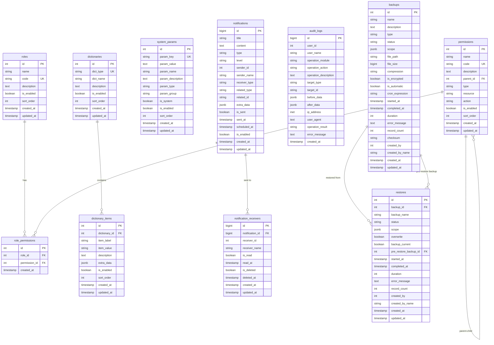

# 数据库设计说明

## 数据库选型

本项目采用 **PostgreSQL** 作为主数据库，原因如下：

- 支持复杂查询和事务处理
- 具备良好的 JSON 数据类型支持
- 支持全文搜索功能
- 具备强大的扩展性和稳定性
- 开源且社区活跃

## 核心数据表结构

### 1. 用户权限管理

#### 角色表 (roles)

| 字段名 | 数据类型 | 约束 | 描述 |
|--------|----------|------|------|
| id | SERIAL | PRIMARY KEY | 角色ID |
| name | VARCHAR(100) | NOT NULL | 角色名称 |
| code | VARCHAR(50) | NOT NULL, UNIQUE | 角色代码 |
| description | TEXT | | 角色描述 |
| is_enabled | BOOLEAN | NOT NULL DEFAULT true | 是否启用 |
| sort_order | INTEGER | DEFAULT 0 | 排序 |
| created_at | TIMESTAMP | NOT NULL DEFAULT CURRENT_TIMESTAMP | 创建时间 |
| updated_at | TIMESTAMP | NOT NULL DEFAULT CURRENT_TIMESTAMP | 更新时间 |

**索引：**
- `idx_roles_code` ON (code)
- `idx_roles_enabled` ON (is_enabled)

#### 权限表 (permissions)

| 字段名 | 数据类型 | 约束 | 描述 |
|--------|----------|------|------|
| id | SERIAL | PRIMARY KEY | 权限ID |
| name | VARCHAR(100) | NOT NULL | 权限名称 |
| code | VARCHAR(100) | NOT NULL, UNIQUE | 权限代码 |
| description | TEXT | | 权限描述 |
| parent_id | INTEGER | FOREIGN KEY REFERENCES permissions(id) | 父权限ID |
| type | VARCHAR(20) | NOT NULL | 权限类型(MENU/BUTTON/API) |
| resource | VARCHAR(200) | | 资源路径 |
| action | VARCHAR(50) | | 操作动作 |
| is_enabled | BOOLEAN | NOT NULL DEFAULT true | 是否启用 |
| sort_order | INTEGER | DEFAULT 0 | 排序 |
| created_at | TIMESTAMP | NOT NULL DEFAULT CURRENT_TIMESTAMP | 创建时间 |
| updated_at | TIMESTAMP | NOT NULL DEFAULT CURRENT_TIMESTAMP | 更新时间 |

**索引：**
- `idx_permissions_code` ON (code)
- `idx_permissions_parent` ON (parent_id)
- `idx_permissions_type` ON (type)

#### 角色权限关联表 (role_permissions)

| 字段名 | 数据类型 | 约束 | 描述 |
|--------|----------|------|------|
| id | SERIAL | PRIMARY KEY | 关联ID |
| role_id | INTEGER | NOT NULL, FOREIGN KEY REFERENCES roles(id) | 角色ID |
| permission_id | INTEGER | NOT NULL, FOREIGN KEY REFERENCES permissions(id) | 权限ID |
| created_at | TIMESTAMP | NOT NULL DEFAULT CURRENT_TIMESTAMP | 创建时间 |

**索引：**
- `idx_role_permissions_role` ON (role_id)
- `idx_role_permissions_permission` ON (permission_id)
- `uk_role_permissions` UNIQUE (role_id, permission_id)

### 2. 系统参数管理

#### 系统参数表 (system_params)

| 字段名 | 数据类型 | 约束 | 描述 |
|--------|----------|------|------|
| id | SERIAL | PRIMARY KEY | 参数ID |
| param_key | VARCHAR(100) | NOT NULL, UNIQUE | 参数键名 |
| param_value | TEXT | | 参数值 |
| param_name | VARCHAR(200) | NOT NULL | 参数名称 |
| param_description | TEXT | | 参数描述 |
| param_type | VARCHAR(20) | NOT NULL | 参数类型(STRING/NUMBER/BOOLEAN/JSON) |
| param_group | VARCHAR(50) | | 参数分组 |
| is_system | BOOLEAN | NOT NULL DEFAULT false | 是否为系统参数 |
| is_enabled | BOOLEAN | NOT NULL DEFAULT true | 是否启用 |
| sort_order | INTEGER | DEFAULT 0 | 排序 |
| created_at | TIMESTAMP | NOT NULL DEFAULT CURRENT_TIMESTAMP | 创建时间 |
| updated_at | TIMESTAMP | NOT NULL DEFAULT CURRENT_TIMESTAMP | 更新时间 |

**索引：**
- `idx_system_params_key` ON (param_key)
- `idx_system_params_group` ON (param_group)
- `idx_system_params_type` ON (param_type)

### 3. 字典管理

#### 字典类型表 (dictionaries)

| 字段名 | 数据类型 | 约束 | 描述 |
|--------|----------|------|------|
| id | SERIAL | PRIMARY KEY | 字典ID |
| dict_type | VARCHAR(100) | NOT NULL, UNIQUE | 字典类型 |
| dict_name | VARCHAR(200) | NOT NULL | 字典名称 |
| description | TEXT | | 字典描述 |
| is_enabled | BOOLEAN | NOT NULL DEFAULT true | 是否启用 |
| sort_order | INTEGER | DEFAULT 0 | 排序 |
| created_at | TIMESTAMP | NOT NULL DEFAULT CURRENT_TIMESTAMP | 创建时间 |
| updated_at | TIMESTAMP | NOT NULL DEFAULT CURRENT_TIMESTAMP | 更新时间 |

**索引：**
- `idx_dictionaries_type` ON (dict_type)
- `idx_dictionaries_enabled` ON (is_enabled)

#### 字典项表 (dictionary_items)

| 字段名 | 数据类型 | 约束 | 描述 |
|--------|----------|------|------|
| id | SERIAL | PRIMARY KEY | 字典项ID |
| dictionary_id | INTEGER | NOT NULL, FOREIGN KEY REFERENCES dictionaries(id) | 字典ID |
| item_label | VARCHAR(200) | NOT NULL | 字典项标签 |
| item_value | VARCHAR(200) | NOT NULL | 字典项值 |
| description | TEXT | | 字典项描述 |
| extra_data | JSONB | | 扩展数据 |
| is_enabled | BOOLEAN | NOT NULL DEFAULT true | 是否启用 |
| sort_order | INTEGER | DEFAULT 0 | 排序 |
| created_at | TIMESTAMP | NOT NULL DEFAULT CURRENT_TIMESTAMP | 创建时间 |
| updated_at | TIMESTAMP | NOT NULL DEFAULT CURRENT_TIMESTAMP | 更新时间 |

**索引：**
- `idx_dictionary_items_dict` ON (dictionary_id)
- `idx_dictionary_items_value` ON (item_value)
- `idx_dictionary_items_enabled` ON (is_enabled)
- `uk_dictionary_items` UNIQUE (dictionary_id, item_value)

### 4. 操作日志

#### 审计日志表 (audit_logs)

| 字段名 | 数据类型 | 约束 | 描述 |
|--------|----------|------|------|
| id | BIGSERIAL | PRIMARY KEY | 日志ID |
| user_id | INTEGER | | 操作用户ID |
| user_name | VARCHAR(100) | | 操作用户名 |
| operation_module | VARCHAR(50) | NOT NULL | 操作模块 |
| operation_action | VARCHAR(50) | NOT NULL | 操作动作 |
| operation_description | TEXT | | 操作描述 |
| target_type | VARCHAR(50) | | 目标资源类型 |
| target_id | VARCHAR(100) | | 目标资源ID |
| before_data | JSONB | | 操作前数据 |
| after_data | JSONB | | 操作后数据 |
| ip_address | INET | | IP地址 |
| user_agent | TEXT | | 用户代理 |
| operation_result | VARCHAR(20) | NOT NULL | 操作结果(SUCCESS/FAILED) |
| error_message | TEXT | | 错误信息 |
| created_at | TIMESTAMP | NOT NULL DEFAULT CURRENT_TIMESTAMP | 创建时间 |

**索引：**
- `idx_audit_logs_user` ON (user_id)
- `idx_audit_logs_module` ON (operation_module)
- `idx_audit_logs_action` ON (operation_action)
- `idx_audit_logs_target` ON (target_type, target_id)
- `idx_audit_logs_result` ON (operation_result)
- `idx_audit_logs_created` ON (created_at)
- `idx_audit_logs_ip` ON (ip_address)

### 5. 消息通知

#### 通知表 (notifications)

| 字段名 | 数据类型 | 约束 | 描述 |
|--------|----------|------|------|
| id | BIGSERIAL | PRIMARY KEY | 通知ID |
| title | VARCHAR(200) | NOT NULL | 通知标题 |
| content | TEXT | NOT NULL | 通知内容 |
| type | VARCHAR(20) | NOT NULL | 通知类型 |
| level | VARCHAR(20) | NOT NULL | 通知级别 |
| sender_id | INTEGER | | 发送者ID |
| sender_name | VARCHAR(100) | | 发送者姓名 |
| receiver_type | VARCHAR(20) | NOT NULL | 接收者类型(USER/ROLE/ALL) |
| related_type | VARCHAR(50) | | 关联资源类型 |
| related_id | VARCHAR(100) | | 关联资源ID |
| extra_data | JSONB | | 扩展数据 |
| is_sent | BOOLEAN | NOT NULL DEFAULT false | 是否已发送 |
| sent_at | TIMESTAMP | | 发送时间 |
| scheduled_at | TIMESTAMP | | 定时发送时间 |
| is_enabled | BOOLEAN | NOT NULL DEFAULT true | 是否启用 |
| created_at | TIMESTAMP | NOT NULL DEFAULT CURRENT_TIMESTAMP | 创建时间 |
| updated_at | TIMESTAMP | NOT NULL DEFAULT CURRENT_TIMESTAMP | 更新时间 |

**索引：**
- `idx_notifications_type` ON (type)
- `idx_notifications_level` ON (level)
- `idx_notifications_sender` ON (sender_id)
- `idx_notifications_sent` ON (is_sent)
- `idx_notifications_scheduled` ON (scheduled_at)
- `idx_notifications_created` ON (created_at)

#### 通知接收记录表 (notification_receivers)

| 字段名 | 数据类型 | 约束 | 描述 |
|--------|----------|------|------|
| id | BIGSERIAL | PRIMARY KEY | 接收记录ID |
| notification_id | BIGINT | NOT NULL, FOREIGN KEY REFERENCES notifications(id) | 通知ID |
| receiver_id | INTEGER | NOT NULL | 接收者ID |
| receiver_name | VARCHAR(100) | NOT NULL | 接收者姓名 |
| is_read | BOOLEAN | NOT NULL DEFAULT false | 是否已读 |
| read_at | TIMESTAMP | | 阅读时间 |
| is_deleted | BOOLEAN | NOT NULL DEFAULT false | 是否已删除 |
| deleted_at | TIMESTAMP | | 删除时间 |
| created_at | TIMESTAMP | NOT NULL DEFAULT CURRENT_TIMESTAMP | 创建时间 |
| updated_at | TIMESTAMP | NOT NULL DEFAULT CURRENT_TIMESTAMP | 更新时间 |

**索引：**
- `idx_notification_receivers_notification` ON (notification_id)
- `idx_notification_receivers_receiver` ON (receiver_id)
- `idx_notification_receivers_read` ON (is_read)
- `idx_notification_receivers_deleted` ON (is_deleted)
- `uk_notification_receivers` UNIQUE (notification_id, receiver_id)

### 6. 数据备份

#### 备份记录表 (backups)

| 字段名 | 数据类型 | 约束 | 描述 |
|--------|----------|------|------|
| id | SERIAL | PRIMARY KEY | 备份ID |
| name | VARCHAR(200) | NOT NULL | 备份名称 |
| description | TEXT | | 备份描述 |
| type | VARCHAR(20) | NOT NULL | 备份类型(FULL/INCREMENTAL/DIFFERENTIAL) |
| status | VARCHAR(20) | NOT NULL | 备份状态 |
| scope | JSONB | NOT NULL | 备份范围 |
| file_path | VARCHAR(500) | | 文件路径 |
| file_size | BIGINT | DEFAULT 0 | 文件大小(字节) |
| compression | VARCHAR(10) | NOT NULL | 压缩格式 |
| is_encrypted | BOOLEAN | NOT NULL DEFAULT false | 是否加密 |
| is_automatic | BOOLEAN | NOT NULL DEFAULT false | 是否自动备份 |
| cron_expression | VARCHAR(100) | | Cron表达式 |
| started_at | TIMESTAMP | NOT NULL | 开始时间 |
| completed_at | TIMESTAMP | | 完成时间 |
| duration | INTEGER | | 耗时(秒) |
| error_message | TEXT | | 错误信息 |
| record_count | INTEGER | DEFAULT 0 | 备份记录数 |
| checksum | VARCHAR(200) | | 校验和 |
| created_by | INTEGER | NOT NULL | 创建者ID |
| created_by_name | VARCHAR(100) | NOT NULL | 创建者姓名 |
| created_at | TIMESTAMP | NOT NULL DEFAULT CURRENT_TIMESTAMP | 创建时间 |
| updated_at | TIMESTAMP | NOT NULL DEFAULT CURRENT_TIMESTAMP | 更新时间 |

**索引：**
- `idx_backups_type` ON (type)
- `idx_backups_status` ON (status)
- `idx_backups_automatic` ON (is_automatic)
- `idx_backups_created_by` ON (created_by)
- `idx_backups_created` ON (created_at)

#### 恢复记录表 (restores)

| 字段名 | 数据类型 | 约束 | 描述 |
|--------|----------|------|------|
| id | SERIAL | PRIMARY KEY | 恢复记录ID |
| backup_id | INTEGER | NOT NULL, FOREIGN KEY REFERENCES backups(id) | 备份ID |
| backup_name | VARCHAR(200) | NOT NULL | 备份名称 |
| status | VARCHAR(20) | NOT NULL | 恢复状态 |
| scope | JSONB | NOT NULL | 恢复范围 |
| overwrite | BOOLEAN | NOT NULL DEFAULT false | 是否覆盖 |
| backup_current | BOOLEAN | NOT NULL DEFAULT true | 是否备份当前数据 |
| pre_restore_backup_id | INTEGER | FOREIGN KEY REFERENCES backups(id) | 恢复前备份ID |
| started_at | TIMESTAMP | NOT NULL | 开始时间 |
| completed_at | TIMESTAMP | | 完成时间 |
| duration | INTEGER | | 耗时(秒) |
| error_message | TEXT | | 错误信息 |
| record_count | INTEGER | DEFAULT 0 | 恢复记录数 |
| created_by | INTEGER | NOT NULL | 创建者ID |
| created_by_name | VARCHAR(100) | NOT NULL | 创建者姓名 |
| created_at | TIMESTAMP | NOT NULL DEFAULT CURRENT_TIMESTAMP | 创建时间 |
| updated_at | TIMESTAMP | NOT NULL DEFAULT CURRENT_TIMESTAMP | 更新时间 |

**索引：**
- `idx_restores_backup` ON (backup_id)
- `idx_restores_status` ON (status)
- `idx_restores_created_by` ON (created_by)
- `idx_restores_created` ON (created_at)

## 实体关系图 (ERD)

## 数据库配置建议

### 性能优化

1. **连接池配置**
   - 最大连接数：50-100
   - 最小连接数：10
   - 连接超时：30秒

2. **查询优化**
   - 为频繁查询的字段创建索引
   - 使用 EXPLAIN ANALYZE 分析慢查询
   - 定期更新表统计信息

3. **分区策略**
   - audit_logs 表按月分区
   - notifications 表按季度分区

### 备份策略

1. **全量备份**：每日凌晨 2:00
2. **增量备份**：每 6 小时一次
3. **备份保留**：30 天
4. **异地备份**：每周同步到异地存储

### 安全配置

1. **访问控制**
   - 使用专用数据库用户
   - 限制网络访问
   - 启用 SSL 连接

2. **数据加密**
   - 敏感字段加密存储
   - 传输层加密
   - 备份文件加密

3. **审计日志**
   - 启用数据库审计
   - 记录所有 DDL 操作
   - 监控异常访问