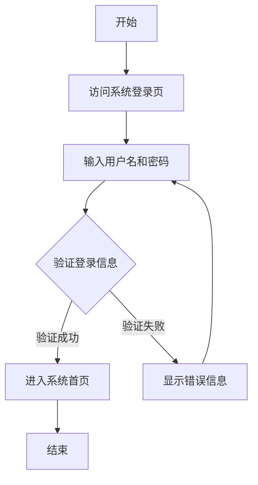
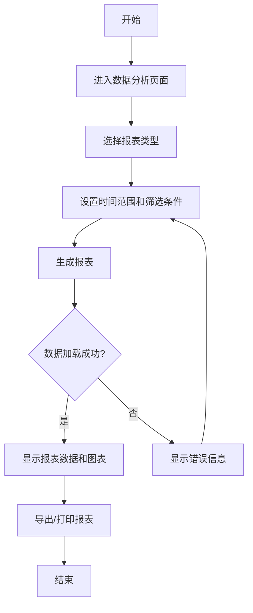

# CRM管理后台系统用户操作流程图

## 1. 系统登录流程



## 2. 用户管理流程

### 2.1 创建新用户

```mermaid
flowchart TD
    A[开始] --> B[进入用户管理页面]
    B --> C[点击"创建新用户"按钮]
    C --> D[填写用户信息表单]
    D --> E{表单验证}
    E -->|验证失败| F[显示错误信息]
    F --> D
    E -->|验证成功| G[提交表单]
    G --> H{保存成功?}
    H -->|是| I[显示成功提示]
    H -->|否| J[显示错误信息]
    J --> D
    I --> K[返回用户列表]
    K --> L[结束]
```

### 2.2 编辑用户信息

```mermaid
flowchart TD
    A[开始] --> B[进入用户管理页面]
    B --> C[在用户列表中找到目标用户]
    C --> D[点击"编辑"按钮]
    D --> E[修改用户信息]
    E --> F{表单验证}
    F -->|验证失败| G[显示错误信息]
    G --> E
    F -->|验证成功| H[提交表单]
    H --> I{保存成功?}
    I -->|是| J[显示成功提示]
    I -->|否| K[显示错误信息]
    K --> E
    J --> L[返回用户列表]
    L --> M[结束]
```

## 3. 就诊人管理流程

### 3.1 创建就诊人档案

```mermaid
flowchart TD
    A[开始] --> B[进入就诊人管理页面]
    B --> C[点击"创建就诊人"按钮]
    C --> D[填写就诊人信息表单]
    D --> E{表单验证}
    E -->|验证失败| F[显示错误信息]
    F --> D
    E -->|验证成功| G[提交表单]
    G --> H{保存成功?}
    H -->|是| I[显示成功提示]
    H -->|否| J[显示错误信息]
    J --> D
    I --> K[返回就诊人列表]
    K --> L[结束]
```

### 3.2 关联就诊人到用户

```mermaid
flowchart TD
    A[开始] --> B[进入就诊人管理页面]
    B --> C[在就诊人列表中找到目标就诊人]
    C --> D[点击"关联用户"按钮]
    D --> E[搜索并选择用户]
    E --> F[设置关系类型]
    F --> G[提交关联信息]
    G --> H{关联成功?}
    H -->|是| I[显示成功提示]
    H -->|否| J[显示错误信息]
    J --> E
    I --> K[返回就诊人详情]
    K --> L[结束]
```

## 4. 订单管理流程

### 4.1 创建新订单

```mermaid
flowchart TD
    A[开始] --> B[进入订单管理页面]
    B --> C[点击"创建订单"按钮]
    C --> D[选择用户/就诊人]
    D --> E[选择服务项目]
    E --> F[填写订单信息]
    F --> G{表单验证}
    G -->|验证失败| H[显示错误信息]
    H --> F
    G -->|验证成功| I[提交订单]
    I --> J{创建成功?}
    J -->|是| K[显示成功提示]
    J -->|否| L[显示错误信息]
    L --> F
    K --> M[返回订单列表]
    M --> N[结束]
```

### 4.2 订单支付处理

```mermaid
flowchart TD
    A[开始] --> B[进入订单详情页面]
    B --> C[点击"处理支付"按钮]
    C --> D[选择支付方式]
    D --> E[输入支付金额]
    E --> F{金额验证}
    F -->|验证失败| G[显示错误信息]
    G --> E
    F -->|验证成功| H[提交支付信息]
    H --> I{处理成功?}
    I -->|是| J[更新订单状态为"已支付"]
    I -->|否| K[显示错误信息]
    K --> D
    J --> L[生成收据]
    L --> M[返回订单详情]
    M --> N[结束]
```

### 4.3 订单退款处理

```mermaid
flowchart TD
    A[开始] --> B[进入订单详情页面]
    B --> C[点击"申请退款"按钮]
    C --> D[填写退款原因和金额]
    D --> E{表单验证}
    E -->|验证失败| F[显示错误信息]
    F --> D
    E -->|验证成功| G[提交退款申请]
    G --> H{申请提交成功?}
    H -->|是| I[更新订单状态为"退款中"]
    H -->|否| J[显示错误信息]
    J --> D
    I --> K[返回订单详情]
    K --> L[结束]
```

## 5. 数据分析流程

### 5.1 查看业务报表



### 5.2 自定义报表

```mermaid
flowchart TD
    A[开始] --> B[进入数据分析页面]
    B --> C[点击"自定义报表"按钮]
    C --> D[选择数据维度和指标]
    D --> E[设置筛选条件]
    E --> F[预览报表]
    F --> G{报表符合需求?}
    G -->|否| H[调整报表设置]
    H --> F
    G -->|是| I[保存报表配置]
    I --> J{保存成功?}
    J -->|是| K[显示成功提示]
    J -->|否| L[显示错误信息]
    L --> I
    K --> M[查看生成的报表]
    M --> N[结束]
```

## 6. 系统设置流程

### 6.1 权限管理

```mermaid
flowchart TD
    A[开始] --> B[进入系统设置页面]
    B --> C[选择"权限管理"]
    C --> D[创建/编辑角色]
    D --> E[设置角色权限]
    E --> F[提交角色设置]
    F --> G{保存成功?}
    G -->|是| H[显示成功提示]
    G -->|否| I[显示错误信息]
    I --> E
    H --> J[分配用户到角色]
    J --> K{分配成功?}
    K -->|是| L[显示成功提示]
    K -->|否| M[显示错误信息]
    M --> J
    L --> N[返回权限管理页面]
    N --> O[结束]
```

### 6.2 系统参数配置

```mermaid
flowchart TD
    A[开始] --> B[进入系统设置页面]
    B --> C[选择"系统参数"]
    C --> D[修改系统参数]
    D --> E[提交参数设置]
    E --> F{保存成功?}
    F -->|是| G[显示成功提示]
    F -->|否| H[显示错误信息]
    H --> D
    G --> I[系统应用新参数]
    I --> J[返回系统设置页面]
    J --> K[结束]
```

## 7. 个人设置流程

### 7.1 修改个人信息

```mermaid
flowchart TD
    A[开始] --> B[点击顶部导航栏用户头像]
    B --> C[选择"个人设置"]
    C --> D[修改个人信息]
    D --> E{表单验证}
    E -->|验证失败| F[显示错误信息]
    F --> D
    E -->|验证成功| G[提交修改]
    G --> H{保存成功?}
    H -->|是| I[显示成功提示]
    H -->|否| J[显示错误信息]
    J --> D
    I --> K[更新显示的用户信息]
    K --> L[结束]
```

### 7.2 修改密码

```mermaid
flowchart TD
    A[开始] --> B[点击顶部导航栏用户头像]
    B --> C[选择"修改密码"]
    C --> D[输入当前密码和新密码]
    D --> E{表单验证}
    E -->|验证失败| F[显示错误信息]
    F --> D
    E -->|验证成功| G[提交修改]
    G --> H{修改成功?}
    H -->|是| I[显示成功提示]
    H -->|否| J[显示错误信息]
    J --> D
    I --> K[返回登录页面]
    K --> L[结束]
```