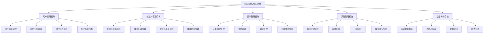
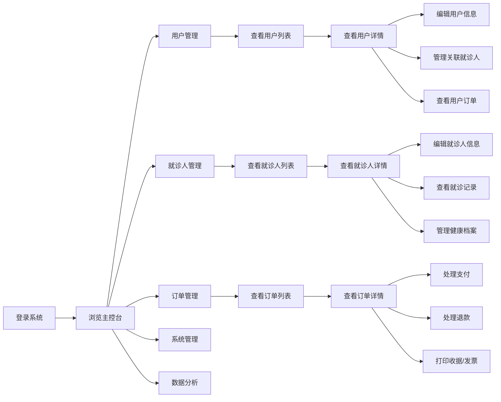
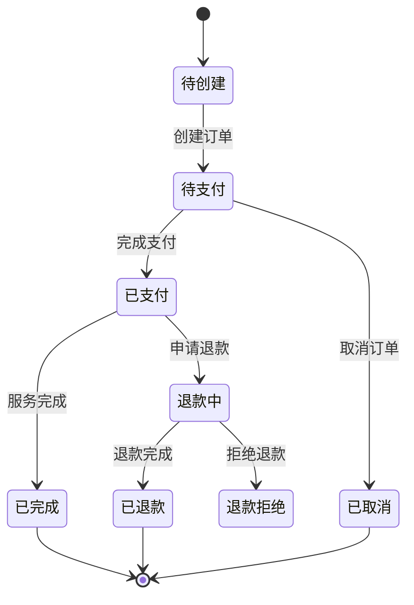
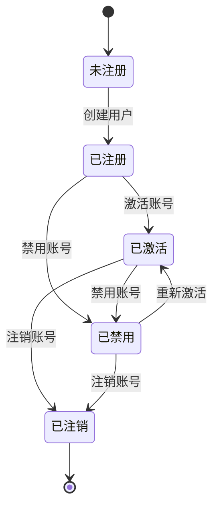
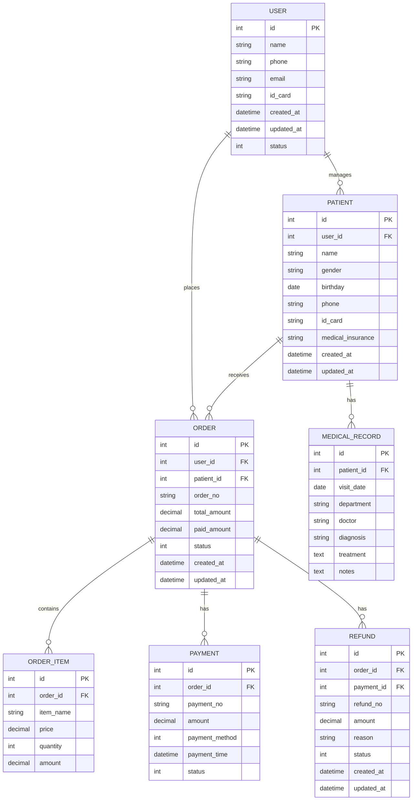

# CRM管理后台系统产品需求文档(PRD)

## 1. 文档信息

### 1.1 版本历史

| 版本号 | 日期 | 修订人 | 修订说明 |
| --- | --- | --- | --- |
| v1.0.0 | 2023-11-01 | 产品经理 | 初始版本 |

### 1.2 文档目的

本文档旨在详细描述CRM管理后台系统的产品需求，为设计、开发、测试等团队提供明确的指导和参考。文档包含产品概述、用户研究、市场分析、功能需求、技术架构等内容，确保所有相关方对产品有一致的理解。

### 1.3 相关文档引用

- [产品路线图](/docs/Roadmap.md)
- [用户故事地图](/docs/User_Story_Map.md)
- [产品评估指标框架](/docs/Metrics_Framework.md)

## 2. 产品概述

### 2.1 产品名称与定位

**产品名称**：MediCRM管理后台系统

**产品定位**：一站式医疗服务管理平台，专为医疗机构设计的客户关系管理系统，帮助医疗机构高效管理用户信息、就诊人数据和订单流程。

### 2.2 产品愿景与使命

**愿景**：成为医疗行业最受信赖的客户关系管理解决方案。

**使命**：通过数字化工具提升医疗机构的运营效率，优化患者服务体验，促进医患关系和谐发展。

### 2.3 价值主张与独特卖点(USP)

- **一体化管理**：整合用户、就诊人和订单管理于一体，实现数据互通和业务协同
- **流程优化**：简化医疗服务流程，减少管理环节，提高工作效率
- **数据洞察**：提供多维度数据分析，支持决策优化和精准营销
- **安全合规**：严格遵循医疗数据安全和隐私保护规范，确保信息安全

### 2.4 目标平台列表

- **Web浏览器**：支持主流浏览器，包括Chrome、Firefox、Safari、Edge等

### 2.5 产品核心假设

1. 医疗机构需要一个集中式平台管理用户、就诊人和订单信息
2. 管理人员需要高效的工具来处理日常运营事务
3. 数据安全和隐私保护是医疗行业的核心需求
4. 用户体验的优化将显著提升工作效率
5. 数据分析能力将帮助机构做出更明智的决策

### 2.6 商业模式概述

本产品采用SaaS订阅模式，按照医疗机构规模和功能需求提供不同级别的服务套餐：

- **基础版**：适合小型诊所，提供核心用户和订单管理功能
- **专业版**：适合中型医疗机构，增加高级分析和多角色权限管理
- **企业版**：适合大型医院或医疗集团，提供定制化功能和专属支持

## 3. 用户研究

### 3.1 目标用户画像

#### 3.1.1 人口统计特征

**主要用户群体**：医疗机构管理人员

1. **医疗机构管理员**
   - 年龄：30-50岁
   - 教育程度：本科及以上
   - 职位：医院管理层、诊所负责人
   - 技术熟悉度：中等

2. **前台接待人员**
   - 年龄：22-35岁
   - 教育程度：大专及以上
   - 职位：前台接待、客服
   - 技术熟悉度：中等至较高

3. **医疗财务人员**
   - 年龄：25-45岁
   - 教育程度：本科，财务相关专业
   - 职位：财务主管、会计
   - 技术熟悉度：中等

#### 3.1.2 行为习惯与偏好

1. **医疗机构管理员**
   - 习惯使用电脑处理管理工作
   - 重视数据安全和系统稳定性
   - 偏好简洁清晰的数据展示
   - 需要全局视图和决策支持工具

2. **前台接待人员**
   - 频繁处理患者登记和预约
   - 需要快速响应的界面
   - 偏好操作简单、步骤少的流程
   - 经常需要同时处理多项任务

3. **医疗财务人员**
   - 定期处理账单和财务报表
   - 重视数据准确性和一致性
   - 需要详细的交易记录和财务分析
   - 偏好可导出和打印的报表功能

#### 3.1.3 核心需求与痛点

1. **医疗机构管理员**
   - **需求**：全面了解机构运营状况，优化资源配置
   - **痛点**：
     - 缺乏统一的管理平台，数据分散在多个系统
     - 难以获取实时运营数据
     - 报表生成耗时且不够灵活

2. **前台接待人员**
   - **需求**：高效处理患者信息和预约
   - **痛点**：
     - 重复录入患者信息浪费时间
     - 预约变更流程复杂
     - 缺乏患者历史就诊记录快速查询功能

3. **医疗财务人员**
   - **需求**：准确记录和分析财务数据
   - **痛点**：
     - 订单与财务系统不同步
     - 退款和调整流程繁琐
     - 财务报表生成不够灵活

#### 3.1.4 动机与目标

1. **医疗机构管理员**
   - 提高机构整体运营效率
   - 降低管理成本
   - 提升患者满意度和忠诚度
   - 做出数据驱动的决策

2. **前台接待人员**
   - 减少重复性工作
   - 提高服务响应速度
   - 减少错误和遗漏
   - 提升患者服务体验

3. **医疗财务人员**
   - 确保财务数据准确性
   - 简化对账和结算流程
   - 提高财务透明度
   - 优化收入管理

### 3.2 用户场景分析

#### 3.2.1 核心使用场景详述

**场景一：新患者注册与信息管理**

前台接待人员需要为首次就诊的患者创建用户档案，记录基本信息、联系方式和医保状态等。系统应支持快速录入、信息验证和重复检查，确保数据准确性和完整性。

**场景二：就诊人关系管理**

用户可能为自己的家人（如老人、孩子）创建多个就诊人档案。前台人员需要能够查看用户关联的所有就诊人信息，并根据需要添加、修改或关联新的就诊人。

**场景三：订单创建与处理**

当患者选择服务项目后，前台人员需要创建订单，包括服务项目、价格、支付方式等信息。系统应支持多种支付方式，并能够生成电子收据和发票。

**场景四：数据分析与报表生成**

管理员需要定期查看运营数据，如患者流量、服务项目受欢迎程度、收入统计等。系统应提供直观的数据可视化和灵活的报表生成功能。

#### 3.2.2 边缘使用场景考量

**场景一：数据迁移与导入**

医疗机构可能需要从旧系统导入历史数据。系统应提供批量导入功能，支持常见格式（如Excel、CSV）的数据导入，并进行数据验证和冲突处理。

**场景二：系统故障恢复**

在系统故障或网络中断情况下，医疗机构仍需继续服务。系统应提供离线模式或应急方案，确保基本业务不中断，并在恢复后能够同步离线数据。

**场景三：季节性业务高峰**

特定季节（如流感季）可能出现患者激增情况。系统应能够应对高并发访问，保持响应速度和稳定性。

### 3.3 用户调研洞察

通过对多家医疗机构的调研，我们发现：

1. **数据整合需求强烈**：90%的医疗机构正在使用多个系统管理不同业务，导致数据孤岛和重复工作
2. **移动办公趋势明显**：65%的管理人员希望能够通过移动设备查看关键数据和处理紧急事务
3. **安全合规是首要考虑**：所有受访机构都将数据安全和隐私保护列为选择系统的首要标准
4. **个性化需求显著**：不同规模和类型的医疗机构对系统功能和流程有明显不同的需求
5. **用户体验期望提高**：年轻一代医疗工作者对系统易用性和现代化界面有更高期望

## 4. 市场与竞品分析

### 4.1 市场规模与增长预测

医疗CRM市场正处于快速增长阶段：

- 全球医疗CRM市场规模预计从2022年的120亿美元增长到2027年的250亿美元
- 年复合增长率(CAGR)约为15.8%
- 中国市场增速高于全球平均水平，预计CAGR达到20%以上
- 疫情后医疗数字化转型加速，进一步推动市场增长

### 4.2 行业趋势分析

1. **云端部署成主流**：超过70%的新增医疗CRM系统采用云端部署模式
2. **AI应用普及**：智能预测、自动化工作流和智能推荐成为竞争焦点
3. **移动化加速**：移动端功能日益丰富，支持随时随地办公
4. **数据安全升级**：更严格的数据加密和访问控制成为标配
5. **整合化趋势**：CRM与HIS、EMR等系统深度整合，实现数据互通

### 4.3 竞争格局分析

#### 4.3.1 直接竞争对手详析

**竞品A：MediConnect**
- **优势**：功能全面，与多种医院信息系统兼容
- **劣势**：价格较高，定制化能力有限
- **定价**：基础版¥2000/月起，按用户数阶梯定价
- **特色功能**：AI辅助诊断推荐，患者生命周期管理

**竞品B：ClinicMaster**
- **优势**：操作简单，上手快，适合小型诊所
- **劣势**：高级分析功能不足，扩展性有限
- **定价**：¥800/月起，包含5个用户账号
- **特色功能**：智能预约提醒，简易财务管理

**竞品C：HealthCRM**
- **优势**：强大的数据分析能力，支持多语言
- **劣势**：界面复杂，学习曲线陡峭
- **定价**：按模块收费，完整版约¥3500/月
- **特色功能**：高级患者画像，精准营销工具

#### 4.3.2 间接竞争对手概述

1. **通用型CRM系统**：如Salesforce、Zoho CRM等，虽非专为医疗行业设计，但部分医疗机构会选择定制这些平台
2. **医院信息系统(HIS)**：部分大型HIS系统包含简单的客户管理功能
3. **预约管理软件**：专注于预约功能的轻量级解决方案
4. **医疗ERP系统**：侧重资源管理，但也覆盖部分客户关系功能

### 4.4 竞品功能对比矩阵

| 功能模块 | MediCRM(我们) | 竞品A | 竞品B | 竞品C |
| --- | --- | --- | --- | --- |
| **用户管理** | ★★★★★ | ★★★★☆ | ★★★☆☆ | ★★★★☆ |
| **就诊人管理** | ★★★★★ | ★★★☆☆ | ★★★★☆ | ★★★☆☆ |
| **订单管理** | ★★★★★ | ★★★★☆ | ★★★☆☆ | ★★★★★ |
| **数据分析** | ★★★★☆ | ★★★☆☆ | ★★☆☆☆ | ★★★★★ |
| **系统集成** | ★★★★☆ | ★★★★★ | ★★☆☆☆ | ★★★★☆ |
| **移动支持** | ★★★★☆ | ★★★★★ | ★★★☆☆ | ★★★☆☆ |
| **安全合规** | ★★★★★ | ★★★★☆ | ★★★☆☆ | ★★★★★ |
| **易用性** | ★★★★★ | ★★★☆☆ | ★★★★★ | ★★☆☆☆ |
| **定制灵活性** | ★★★★☆ | ★★★☆☆ | ★★☆☆☆ | ★★★★☆ |
| **价格性价比** | ★★★★★ | ★★☆☆☆ | ★★★★★ | ★★★☆☆ |

### 4.5 市场差异化策略

基于竞品分析，我们的差异化策略如下：

1. **专注医疗场景优化**：深度理解医疗业务流程，提供更符合医疗机构实际需求的功能
2. **简化复杂性**：在保证功能完备的同时，提供更直观、易用的界面和操作流程
3. **灵活定价模式**：提供模块化选择和按需付费，降低客户采购门槛
4. **无缝集成能力**：提供丰富的API和集成工具，便于与现有系统对接
5. **本地化服务**：提供符合中国医疗行业特点和法规要求的功能和服务

## 5. 产品功能需求

### 5.1 功能架构与模块划分

### 5.2 核心功能详述

#### 5.2.1 用户管理模块

##### 功能描述
作为医疗机构管理员，我想要全面管理用户信息，以便提供个性化服务和精准营销。

##### 用户价值
- 集中管理所有用户信息，建立统一用户视图
- 通过用户分组和标签，实现精细化运营
- 追踪用户行为和偏好，提升服务质量

##### 功能逻辑与规则
1. **用户信息管理**
   - 支持创建、查询、修改、删除用户信息
   - 用户基本信息包括：姓名、性别、年龄、联系方式、证件信息等
   - 支持用户信息导入导出
   - 用户状态管理：正常、冻结、注销等

2. **用户分组管理**
   - 支持创建自定义用户分组
   - 可按照多种条件（年龄段、就诊频率、消费水平等）进行分组
   - 支持批量操作分组内用户

3. **用户标签管理**
   - 支持创建、编辑、删除用户标签
   - 可手动添加标签或根据规则自动打标
   - 支持多维度标签组合查询

4. **用户行为分析**
   - 记录用户就诊历史、消费记录、服务评价等行为数据
   - 提供用户行为时间线视图
   - 支持用户价值评估和流失风险预警

##### 交互要求
- 用户列表页支持多条件筛选和排序
- 用户详情页采用选项卡式布局，展示不同维度信息
- 提供用户快速搜索功能，支持模糊匹配
- 批量操作需二次确认

##### 数据需求
- 用户基本信息表
- 用户标签关联表
- 用户分组关联表
- 用户行为记录表

##### 技术依赖
- 短信服务API（用于用户通知）
- 数据加密服务（用于敏感信息保护）

##### 验收标准
- 能够成功创建、编辑、查询和删除用户信息
- 用户分组和标签功能正常运行
- 用户数据导入导出功能正常
- 用户搜索响应时间<2秒
- 敏感信息（如身份证号）显示时部分隐藏

#### 5.2.2 就诊人管理模块

##### 功能描述
作为前台接待人员，我想要高效管理就诊人信息和就诊记录，以便提供连贯的医疗服务体验。

##### 用户价值
- 建立完整的就诊人档案，支持家庭成员关联
- 记录详细就诊历史，便于医生了解患者情况
- 提高接诊效率，减少重复信息录入

##### 功能逻辑与规则
1. **就诊人信息管理**
   - 支持创建、查询、修改、删除就诊人信息
   - 就诊人基本信息包括：姓名、性别、年龄、证件信息、联系方式、医保信息等
   - 支持关联到用户账号（一个用户可关联多个就诊人）
   - 支持就诊人照片上传

2. **就诊记录管理**
   - 记录每次就诊的基本信息：就诊日期、科室、医生、诊断结果等
   - 支持上传和查看检查报告、处方等附件
   - 提供就诊记录时间线视图

3. **就诊人关系管理**
   - 支持设置就诊人之间的关系（如父子、夫妻等）
   - 支持家庭成员分组查看
   - 支持就诊人关系图谱可视化

4. **健康档案管理**
   - 记录就诊人过敏史、既往病史、家族病史等
   - 支持重要健康指标记录和趋势图
   - 提供健康风险评估

##### 交互要求
- 就诊人列表支持按关系分组查看
- 就诊记录按时间倒序排列，支持筛选
- 健康档案采用模块化展示，重点信息突出显示
- 提供就诊人快速切换功能

##### 数据需求
- 就诊人基本信息表
- 就诊记录表
- 就诊人关系表
- 健康档案表

##### 技术依赖
- 文件存储服务（用于存储检查报告等附件）
- OCR服务（可选，用于识别纸质报告）

##### 验收标准
- 能够成功创建、编辑、查询和删除就诊人信息
- 就诊记录管理功能正常运行
- 就诊人关系设置和查看功能正常
- 健康档案记录和查看功能正常
- 附件上传和查看功能正常

#### 5.2.3 订单管理模块

##### 功能描述
作为医疗机构财务人员，我想要全面管理订单信息和支付流程，以便提高财务管理效率和准确性。

##### 用户价值
- 简化订单创建和管理流程，提高工作效率
- 清晰记录支付和退款信息，便于财务核对
- 提供多维度订单分析，支持经营决策

##### 功能逻辑与规则
1. **订单创建管理**
   - 支持手动创建订单，关联用户和就诊人
   - 订单信息包括：服务项目、数量、单价、总价、优惠信息等
   - 支持订单状态管理：待支付、已支付、已完成、已取消等
   - 支持订单备注和附加信息

2. **支付管理**
   - 支持多种支付方式：现金、银行卡、医保、微信、支付宝等
   - 记录支付时间、金额、流水号等信息
   - 支持部分支付和分期支付
   - 支持生成电子收据和发票

3. **退款处理**
   - 支持全额和部分退款
   - 记录退款原因、时间、金额等信息
   - 支持退款审批流程
   - 生成退款凭证

4. **订单统计分析**
   - 按时间、科室、服务项目等维度统计订单数据
   - 提供订单趋势图和分布图
   - 支持自定义统计维度和指标

##### 交互要求
- 订单列表支持多条件筛选和排序
- 订单详情页展示完整订单信息和操作历史
- 支付和退款操作需二次确认
- 统计分析页面提供多种图表类型

##### 数据需求
- 订单主表
- 订单明细表
- 支付记录表
- 退款记录表

##### 技术依赖
- 支付网关接口
- 发票开具服务

##### 验收标准
- 能够成功创建、查询和管理订单
- 支付功能正常运行，能够准确记录支付信息
- 退款功能正常运行，能够准确处理退款请求
- 订单统计分析功能正常，数据准确
- 电子收据和发票生成功能正常

### 5.3 次要功能描述

#### 5.3.1 系统管理模块

- **角色权限管理**：创建和管理不同角色，分配相应权限
- **系统配置**：设置系统参数、业务规则、界面选项等
- **日志审计**：记录用户操作日志，支持查询和导出
- **数据备份恢复**：定期备份数据，支持数据恢复

#### 5.3.2 数据分析模块

- **运营数据看板**：展示关键业务指标和趋势
- **自定义报表**：支持用户自定义报表内容和格式
- **数据导出**：支持多种格式导出数据
- **趋势分析**：提供业务数据趋势分析和预测

### 5.4 未来功能储备 (Backlog)

1. **患者满意度调查**：自动发送满意度调查，收集和分析反馈
2. **智能预约系统**：基于医生排班和患者偏好，推荐最佳预约时间
3. **医患沟通平台**：提供安全的医患在线沟通渠道
4. **健康教育内容管理**：发布和管理健康教育内容
5. **AI辅助诊断**：基于患者历史数据，提供诊断参考
6. **多语言支持**：支持多语言界面，满足国际化需求
7. **移动端应用**：开发配套移动应用，支持随时随地办公

## 6. 用户流程与交互设计指导

### 6.1 核心用户旅程地图

### 6.2 关键流程详述与状态转换图

#### 6.2.1 订单处理流程

#### 6.2.2 用户管理流程

### 6.3 对设计师的界面原型参考说明和要求

#### 6.3.1 整体界面风格

- 采用现代简约风格，以蓝色和白色为主色调，体现医疗行业的专业和信任感
- 布局清晰，信息层次分明，减少视觉干扰
- 响应式设计，适应不同屏幕尺寸
- 关键操作按钮突出显示，提高可发现性

#### 6.3.2 关键页面设计要点

**登录页面**
- 简洁大方，突出品牌标识
- 提供记住账号功能
- 支持多因素认证

**控制台首页**
- 展示关键业务指标和提醒
- 提供快速访问常用功能的入口
- 显示最近活动和待办事项

**用户管理页面**
- 表格式展示用户列表，支持分页
- 提供多种筛选和排序选项
- 用户详情页采用选项卡式布局

**就诊人管理页面**
- 支持列表视图和关系图谱视图切换
- 就诊记录采用时间线形式展示
- 健康档案采用卡片式布局

**订单管理页面**
- 订单列表支持状态颜色标识
- 订单详情页清晰展示订单各项信息
- 支付和退款操作流程简化

### 6.4 交互设计规范与原则建议

1. **一致性原则**：保持界面元素、操作方式和反馈机制的一致性
2. **可见性原则**：重要功能和信息应当明显可见，减少隐藏操作
3. **反馈原则**：所有操作都应有明确的反馈，特别是耗时操作
4. **容错原则**：设计应允许用户犯错并提供恢复机制
5. **效率原则**：减少操作步骤，提供快捷方式和批量操作
6. **分层原则**：信息按重要性分层展示，避免信息过载
7. **引导原则**：对复杂流程提供步骤引导和提示

## 7. 非功能需求

### 7.1 性能需求

1. **响应时间**
   - 页面加载时间：首次加载<3秒，二次加载<1秒
   - 数据查询响应：简单查询<1秒，复杂查询<3秒
   - 报表生成：简单报表<5秒，复杂报表<30秒

2. **并发量**
   - 支持100个并发用户正常操作
   - 峰值时段能够支持200个并发用户

3. **稳定性**
   - 系统年可用性达到99.9%
   - 计划内维护时间不超过每月4小时

4. **资源使用率**
   - 客户端内存占用<500MB
   - 数据库查询CPU使用率峰值<70%

### 7.2 安全需求

1. **数据加密**
   - 传输数据采用HTTPS协议
   - 敏感数据（如身份证号、病历）存储时加密
   - 密码采用不可逆加密存储

2. **认证授权**
   - 实施基于角色的访问控制(RBAC)
   - 支持多因素认证
   - 敏感操作需二次验证

3. **隐私保护**
   - 符合医疗数据隐私保护法规
   - 实现数据访问审计日志
   - 支持数据脱敏展示

4. **防攻击策略**
   - 防SQL注入
   - 防XSS攻击
   - 防CSRF攻击
   - 实施登录失败锁定机制

### 7.3 可用性与可访问性标准

1. **易用性要求**
   - 新用户培训时间<2小时
   - 常用操作步骤<3步
   - 提供上下文帮助和用户指南

2. **可访问性标准**
   - 符合WCAG 2.1 AA级标准
   - 支持键盘导航
   - 支持屏幕阅读器
   - 提供足够的色彩对比度

### 7.4 合规性要求

1. **行业法规**
   - 符合《医疗机构管理条例》要求
   - 符合《网络安全法》要求
   - 符合《个人信息保护法》要求

2. **数据保留**
   - 医疗数据保留期不少于15年
   - 提供数据归档和清理机制

3. **审计要求**
   - 记录所有数据访问和修改操作
   - 审计日志不可篡改
   - 支持审计日志导出和分析

### 7.5 数据统计与分析需求

1. **关键事件埋点**
   - 用户登录和退出
   - 重要数据创建、修改和删除
   - 订单创建和状态变更
   - 报表生成和导出

2. **统计指标**
   - 用户活跃度和留存率
   - 功能使用频率和时长
   - 订单转化率和完成率
   - 系统错误率和响应时间

## 8. 技术架构考量

### 8.1 技术栈建议

**前端技术**
- 框架：React/Vue.js
- UI组件库：Ant Design/Element UI
- 状态管理：Redux/Vuex
- 图表库：ECharts/Chart.js

**后端技术**
- 语言：Java/Node.js
- 框架：Spring Boot/Express.js
- 数据库：MySQL/PostgreSQL
- 缓存：Redis

**部署环境**
- Web服务器：Nginx
- 应用服务器：Tomcat/Node.js
- 容器化：Docker
- 云服务：阿里云/腾讯云

### 8.2 系统集成需求

1. **外部系统集成**
   - 医院信息系统(HIS)集成
   - 电子病历系统(EMR)集成
   - 医保结算系统集成
   - 第三方支付平台集成

2. **数据交换标准**
   - 支持HL7标准
   - 支持FHIR标准
   - 提供标准化API接口

3. **集成方式**
   - RESTful API
   - WebService
   - 数据库直连（特殊情况）
   - 消息队列

### 8.3 技术依赖与约束

1. **必要依赖**
   - 短信服务提供商
   - 电子发票服务
   - 文件存储服务
   - 身份认证服务

2. **性能约束**
   - 数据库单表记录不超过1000万
   - 单次查询返回记录不超过1000条
   - 文件上传大小限制为20MB

3. **兼容性约束**
   - 支持Chrome、Firefox、Safari、Edge最新版本
   - 最低支持1366x768分辨率

### 8.4 数据模型建议

**核心实体关系**

## 9. 验收标准汇总

### 9.1 功能验收标准矩阵

| 功能模块 | 验收标准 | 优先级 |
| --- | --- | --- |
| **用户管理** | 1. 能够成功创建、编辑、查询和删除用户信息 2. 用户分组和标签功能正常运行 3. 用户数据导入导出功能正常 4. 用户搜索响应时间<2秒 | P0 |
| **就诊人管理** | 1. 能够成功创建、编辑、查询和删除就诊人信息 2. 就诊记录管理功能正常运行 3. 就诊人关系设置和查看功能正常 4. 健康档案记录和查看功能正常 | P0 |
| **订单管理** | 1. 能够成功创建、查询和管理订单 2. 支付功能正常运行，能够准确记录支付信息 3. 退款功能正常运行，能够准确处理退款请求 4. 订单统计分析功能正常，数据准确 | P0 |
| **系统管理** | 1. 角色权限设置和管理功能正常 2. 系统配置功能正常 3. 日志审计功能正常 4. 数据备份恢复功能正常 | P1 |
| **数据分析** | 1. 运营数据看板显示正确 2. 自定义报表功能正常 3. 数据导出功能正常 4. 趋势分析功能正常 | P1 |

### 9.2 性能验收标准

| 性能指标 | 验收标准 | 测试方法 |
| --- | --- | --- |
| **响应时间** | 1. 页面加载时间：首次加载<3秒，二次加载<1秒 2. 数据查询响应：简单查询<1秒，复杂查询<3秒 3. 报表生成：简单报表<5秒，复杂报表<30秒 | 性能测试工具 |
| **并发处理** | 1. 支持100个并发用户正常操作 2. 峰值时段能够支持200个并发用户 | 压力测试 |
| **稳定性** | 1. 7*24小时连续运行无崩溃 2. 大数据量处理不卡顿 | 稳定性测试 |

### 9.3 质量验收标准

| 质量指标 | 验收标准 | 测试方法 |
| --- | --- | --- |
| **Bug密度** | 关键功能模块Bug密度<0.5个/KLOC | 代码审查和测试 |
| **代码覆盖率** | 单元测试覆盖率>80% | 代码覆盖率工具 |
| **安全漏洞** | 无高危安全漏洞，中危漏洞<3个 | 安全扫描工具 |
| **兼容性** | 支持Chrome、Firefox、Safari、Edge最新版本 | 兼容性测试 |

## 10. 产品成功指标

### 10.1 关键绩效指标 (KPIs) 定义与目标

| KPI | 定义 | 目标值 | 测量周期 |
| --- | --- | --- | --- |
| **用户采用率** | 医疗机构员工中使用系统的比例 | >90% | 月度 |
| **功能使用率** | 核心功能的使用频率 | 每用户每日>10次 | 周度 |
| **任务完成时间** | 完成核心任务所需的平均时间 | 减少30% | 季度 |
| **用户满意度** | 用户满意度调查得分 | >4.5/5分 | 季度 |
| **系统稳定性** | 系统故障率 | <0.1% | 月度 |
| **数据准确率** | 数据录入和处理的准确性 | >99.9% | 月度 |

### 10.2 北极星指标定义与选择依据

**北极星指标**：任务完成效率（每日完成的核心业务任务数/工作时间）

**选择依据**：
1. 直接反映系统对业务效率的提升
2. 易于测量和理解
3. 与用户价值直接相关
4. 能够指导产品优化方向
5. 与业务目标高度一致

### 10.3 指标监测计划

**数据收集方法**
- 系统自动记录用户行为数据
- 定期用户满意度调查
- 系统性能监控工具
- 客户支持反馈分析

**报告频率**
- 日常运营指标：每日报告
- 用户行为指标：每周报告
- 业务成效指标：每月报告
- 综合评估报告：每季度报告

**指标应用**
- 定期产品优化会议讨论指标表现
- 基于指标制定产品迭代计划
- 将关键指标与团队绩效挂钩
- 向客户展示价值实现情况