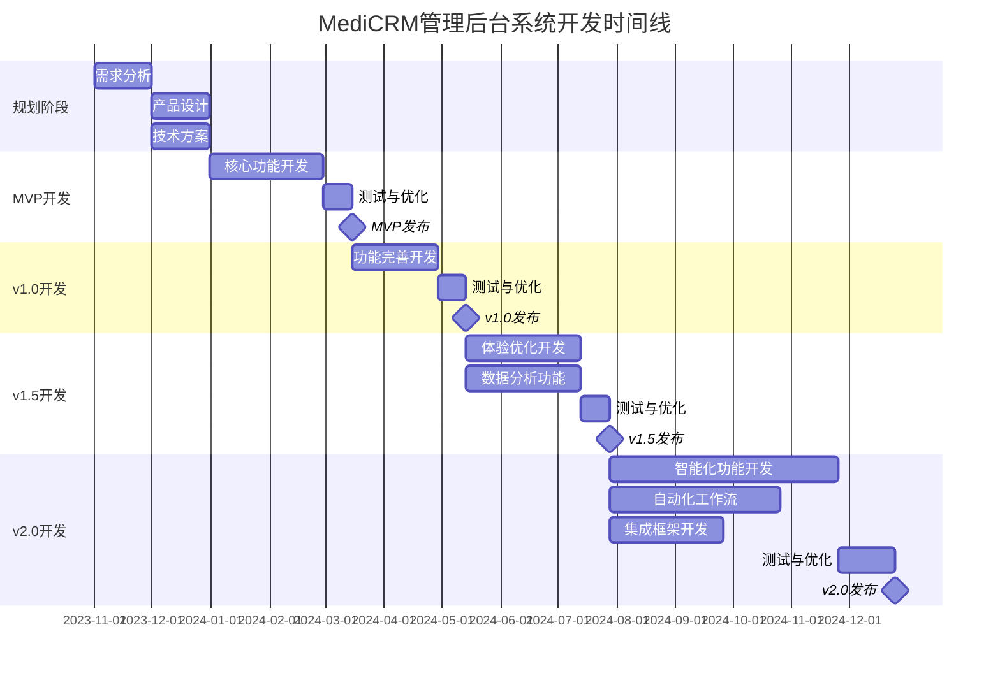

# CRM管理后台系统产品路线图 (Roadmap)

## 1. 路线图概述

本路线图概述了MediCRM管理后台系统的开发计划和演进路径，旨在为产品团队提供清晰的开发方向和里程碑。路线图基于业务优先级、技术可行性和市场需求制定，将随着项目进展和需求变化进行动态调整。

### 1.1 路线图目标

- 明确产品各阶段的发展目标和功能范围
- 建立合理的开发节奏和资源分配计划
- 确保核心价值快速交付，并持续迭代优化
- 平衡短期目标和长期愿景

### 1.2 路线图制定原则

- **价值驱动**：优先开发能为用户带来最大价值的功能
- **渐进交付**：采用增量开发方式，确保每个版本都有可用价值
- **技术可行性**：考虑技术复杂度和依赖关系
- **资源约束**：根据团队规模和能力合理规划
- **市场反馈**：保持灵活性，根据用户反馈调整计划

## 2. 版本规划策略

### 2.1 版本命名与周期

- **主版本**：采用语义化版本号（如v1.0, v2.0），代表重大功能更新或架构变更
- **次版本**：采用小数点后一位（如v1.1, v1.2），代表功能增强或模块添加
- **修订版本**：采用小数点后两位（如v1.1.1），代表bug修复或小改进

### 2.2 发布周期

- **MVP**：项目启动后3个月内发布
- **主版本**：每6-12个月发布一次
- **次版本**：每2-3个月发布一次
- **修订版本**：根据需要随时发布，通常每2-4周一次

### 2.3 版本主题策略

每个主要版本将围绕特定主题或目标设计，确保产品演进有明确方向：

- **v1.0 (基础版)**：建立核心业务流程，满足基本管理需求
- **v2.0 (增强版)**：提升用户体验，增强数据分析能力
- **v3.0 (智能版)**：引入AI和自动化，提供智能决策支持

## 3. 详细版本规划

### 3.1 MVP (v0.9) - 核心功能验证

**发布时间**：项目启动后3个月

**核心目标**：验证产品核心价值，建立基础业务流程

**功能范围**：
- 用户管理基础功能（创建、查询、编辑、删除）
- 就诊人基础管理（创建、关联、查询）
- 简单订单管理（创建、查询、状态更新）
- 基础权限控制
- 简单报表统计

**技术重点**：
- 建立基础技术架构
- 数据库设计与实现
- 核心API开发
- 基础UI框架搭建

**成功标准**：
- 完成所有P0级功能
- 核心业务流程可正常运行
- 系统稳定性达到基本要求
- 获得初步用户反馈

### 3.2 v1.0 (基础版) - 完整业务流程

**发布时间**：MVP后2个月

**核心目标**：建立完整业务流程，满足日常运营需求

**功能范围**：
- 完善用户管理（分组、标签、导入导出）
- 完善就诊人管理（健康档案、就诊记录）
- 完整订单管理（支付、退款、发票）
- 基础数据分析（预设报表）
- 完善系统管理（角色权限、日志审计）

**技术重点**：
- 性能优化
- 安全加固
- UI/UX完善
- 接口标准化

**成功标准**：
- 所有P0和P1级功能完成
- 系统可支持日常业务运营
- 用户满意度达到4.0/5.0以上
- 核心业务指标有明显提升

### 3.3 v1.5 (增强版) - 体验优化与数据分析

**发布时间**：v1.0后3个月

**核心目标**：优化用户体验，增强数据分析能力

**功能范围**：
- 用户行为分析
- 高级就诊人关系管理
- 订单多维度统计分析
- 自定义报表工具
- 数据导出与共享
- 批量操作功能
- UI/UX全面优化

**技术重点**：
- 数据分析引擎
- 前端交互优化
- 报表生成工具
- 批处理机制

**成功标准**：
- 用户操作效率提升30%
- 报表生成时间减少50%
- 用户满意度达到4.3/5.0以上
- 数据分析功能被积极使用

### 3.4 v2.0 (智能版) - 智能化与自动化

**发布时间**：v1.5后6个月

**核心目标**：引入智能化功能，提升自动化水平

**功能范围**：
- 智能客户画像
- 预测分析（如就诊趋势、收入预测）
- 自动化工作流
- 智能提醒与推荐
- 多维度数据可视化
- 外部系统集成（如HIS、EMR）
- 移动端适配

**技术重点**：
- 机器学习算法
- 工作流引擎
- 高级数据可视化
- API集成框架
- 响应式设计

**成功标准**：
- 自动化处理任务比例达到40%
- 预测准确率达到85%以上
- 用户满意度达到4.5/5.0以上
- 系统集成成功案例不少于3个

### 3.5 v3.0 (生态版) - 生态构建与开放平台

**发布时间**：v2.0后12个月

**核心目标**：构建开放生态，支持定制化和扩展

**功能范围**：
- 开放API平台
- 插件系统
- 多租户架构
- 高级定制化能力
- 国际化支持
- 高级安全特性
- 全面移动化

**技术重点**：
- 微服务架构
- API网关
- 插件框架
- 多租户设计
- 国际化框架

**成功标准**：
- 第三方应用集成数量≥10个
- 定制化实施案例≥5个
- 国际化版本成功部署≥2个
- 平台生态初步形成

## 4. 功能优先级矩阵

### 4.1 优先级定义

- **P0 (必须有)**：产品核心功能，没有这些功能产品无法正常运行或无法满足基本需求
- **P1 (应该有)**：重要功能，显著提升产品价值，但不影响核心功能使用
- **P2 (可以有)**：增强功能，提供更好的用户体验或扩展功能，但可以在后续版本中添加

### 4.2 功能优先级表

| 功能模块 | 功能点 | 优先级 | 计划版本 |
| --- | --- | --- | --- |
| **用户管理** | 用户基本信息管理 | P0 | MVP |
| | 用户分组管理 | P1 | v1.0 |
| | 用户标签管理 | P1 | v1.0 |
| | 用户导入导出 | P1 | v1.0 |
| | 用户行为分析 | P2 | v1.5 |
| **就诊人管理** | 就诊人基本信息管理 | P0 | MVP |
| | 就诊记录管理 | P1 | v1.0 |
| | 就诊人关系管理 | P1 | v1.0 |
| | 健康档案管理 | P1 | v1.0 |
| | 高级关系图谱 | P2 | v1.5 |
| **订单管理** | 订单创建与查询 | P0 | MVP |
| | 订单状态管理 | P0 | MVP |
| | 支付管理 | P1 | v1.0 |
| | 退款处理 | P1 | v1.0 |
| | 发票管理 | P1 | v1.0 |
| | 订单分析 | P2 | v1.5 |
| **系统管理** | 基础权限控制 | P0 | MVP |
| | 角色权限管理 | P1 | v1.0 |
| | 系统配置 | P1 | v1.0 |
| | 日志审计 | P1 | v1.0 |
| | 数据备份恢复 | P2 | v1.5 |
| **数据分析** | 基础统计报表 | P0 | MVP |
| | 预设分析报表 | P1 | v1.0 |
| | 自定义报表 | P2 | v1.5 |
| | 数据可视化 | P2 | v1.5 |
| | 预测分析 | P2 | v2.0 |
| **智能化功能** | 智能提醒 | P2 | v2.0 |
| | 智能客户画像 | P2 | v2.0 |
| | 自动化工作流 | P2 | v2.0 |
| | 智能推荐 | P2 | v2.0 |
| **集成与扩展** | 基础API | P1 | v1.0 |
| | 外部系统集成 | P2 | v2.0 |
| | 开放平台 | P2 | v3.0 |
| | 插件系统 | P2 | v3.0 |

## 5. 详细时间线计划

### 5.1 总体时间线

### 5.2 关键里程碑

| 里程碑 | 计划日期 | 交付内容 | 验收标准 |
| --- | --- | --- | --- |
| **需求确认** | 2023-11-30 | 需求文档、原型图 | 相关方确认需求文档 |
| **技术方案确认** | 2023-12-15 | 技术架构文档、数据模型 | 技术团队评审通过 |
| **MVP发布** | 2024-03-01 | 核心功能可用版本 | 通过验收测试，核心功能可用 |
| **v1.0发布** | 2024-05-15 | 完整业务流程版本 | 所有P0/P1功能完成，通过验收测试 |
| **v1.5发布** | 2024-08-30 | 体验优化与数据分析版本 | 用户体验指标提升，数据分析功能可用 |
| **v2.0发布** | 2025-02-28 | 智能化与自动化版本 | 智能功能可用，自动化流程运行正常 |
| **v3.0发布** | 2026-02-28 | 生态版本 | 开放平台运行正常，支持第三方集成 |

## 6. 资源规划

### 6.1 团队组成建议

| 角色 | MVP阶段 | v1.0阶段 | v1.5及以后 | 职责 |
| --- | --- | --- | --- | --- |
| **产品经理** | 1 | 1 | 1-2 | 需求分析、产品规划、用户研究 |
| **UI/UX设计师** | 1 | 1 | 1-2 | 界面设计、交互设计、用户体验优化 |
| **前端开发** | 2 | 2-3 | 3-4 | 前端界面实现、交互开发 |
| **后端开发** | 2 | 3-4 | 4-6 | API开发、业务逻辑实现、数据处理 |
| **测试工程师** | 1 | 1-2 | 2-3 | 功能测试、性能测试、自动化测试 |
| **DevOps工程师** | 1 | 1 | 1-2 | 环境搭建、部署自动化、监控 |
| **数据分析师** | 0 | 0-1 | 1 | 数据模型设计、分析算法开发 |

### 6.2 技术资源需求

| 资源类型 | MVP阶段 | v1.0阶段 | v1.5及以后 | 说明 |
| --- | --- | --- | --- | --- |
| **开发环境** | 基础配置 | 中等配置 | 高配置 | 开发机器、测试服务器等 |
| **服务器资源** | 2-4台 | 4-6台 | 8-12台 | 应用服务器、数据库服务器等 |
| **第三方服务** | 基础套餐 | 标准套餐 | 企业套餐 | 云服务、短信服务、支付服务等 |
| **开发工具** | 基础版 | 专业版 | 企业版 | IDE、设计工具、测试工具等 |

### 6.3 预算估算

| 费用类型 | MVP阶段 | v1.0阶段 | v1.5及以后 | 总计 |
| --- | --- | --- | --- | --- |
| **人力成本** | ¥500,000 | ¥800,000 | ¥2,000,000 | ¥3,300,000 |
| **硬件投入** | ¥100,000 | ¥150,000 | ¥300,000 | ¥550,000 |
| **软件许可** | ¥50,000 | ¥80,000 | ¥200,000 | ¥330,000 |
| **第三方服务** | ¥30,000 | ¥60,000 | ¥150,000 | ¥240,000 |
| **其他费用** | ¥50,000 | ¥80,000 | ¥200,000 | ¥330,000 |
| **总计** | ¥730,000 | ¥1,170,000 | ¥2,850,000 | ¥4,750,000 |

## 7. 风险管理

### 7.1 主要风险识别

| 风险类型 | 风险描述 | 影响程度 | 发生概率 | 风险等级 |
| --- | --- | --- | --- | --- |
| **需求风险** | 需求理解不一致或频繁变更 | 高 | 中 | 高 |
| **技术风险** | 技术方案不成熟或实现难度超出预期 | 高 | 中 | 高 |
| **资源风险** | 关键人员流失或资源不足 | 中 | 中 | 中 |
| **进度风险** | 开发进度延迟，无法按时交付 | 中 | 高 | 高 |
| **质量风险** | 产品质量不达标，影响用户体验 | 高 | 中 | 高 |
| **集成风险** | 与外部系统集成困难 | 中 | 中 | 中 |
| **安全风险** | 数据安全或隐私保护问题 | 高 | 低 | 中 |
| **市场风险** | 市场需求变化或竞争加剧 | 中 | 中 | 中 |

### 7.2 风险应对策略

| 风险类型 | 应对策略 | 责任方 | 触发条件 |
| --- | --- | --- | --- |
| **需求风险** | 1. 建立需求变更管理流程 2. 定期需求评审会议 3. 采用原型验证需求 | 产品经理 | 需求变更频率>每周1次 |
| **技术风险** | 1. 关键技术提前验证 2. 保持技术方案灵活性 3. 必要时寻求外部专家支持 | 技术负责人 | 技术实现进度滞后>20% |
| **资源风险** | 1. 关键岗位备份机制 2. 提前规划人力需求 3. 建立知识共享机制 | 项目经理 | 团队成员流失率>10% |
| **进度风险** | 1. 合理规划缓冲时间 2. 采用敏捷开发方法 3. 定期进度跟踪与调整 | 项目经理 | 进度延迟>2周 |
| **质量风险** | 1. 建立完善的测试体系 2. 早期用户参与测试 3. 持续集成与自动化测试 | 测试负责人 | Bug密度>0.5个/KLOC |
| **集成风险** | 1. 提前进行集成测试 2. 建立明确的接口规范 3. 与第三方系统提供方密切沟通 | 技术负责人 | 集成测试失败率>20% |
| **安全风险** | 1. 定期安全审计 2. 遵循安全开发规范 3. 数据加密与访问控制 | 安全负责人 | 发现高危安全漏洞 |
| **市场风险** | 1. 定期市场调研 2. 保持产品灵活性 3. 快速响应市场变化 | 产品经理 | 市场份额下降>10% |

### 7.3 应急预案

1. **重大需求变更**：评估影响，调整计划，必要时推迟非关键功能
2. **技术难题阻塞**：组织攻关小组，必要时调整技术方案
3. **关键人员离职**：启动备份机制，加速知识转移，必要时外部招聘
4. **严重进度延迟**：重新评估范围，增加资源，调整交付计划
5. **重大质量问题**：暂停新功能开发，集中解决质量问题
6. **安全事件**：启动安全应急响应，修复漏洞，必要时暂停服务

## 8. 路线图更新机制

### 8.1 定期评审

- 每月进行一次进度评审
- 每季度进行一次路线图回顾与调整
- 每个主要版本发布后进行全面评估

### 8.2 调整触发条件

- 核心业务需求发生重大变化
- 技术实现遇到重大障碍
- 市场环境或竞争格局显著变化
- 用户反馈指向明确的优先级调整需求
- 资源配置发生重大变化

### 8.3 变更管理流程

1. 提出变更申请（包含原因、影响分析）
2. 产品委员会评审
3. 确定变更范围和影响
4. 更新路线图文档
5. 向相关方沟通变更
6. 调整执行计划