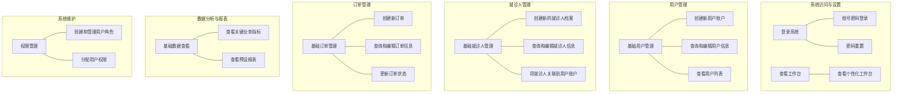
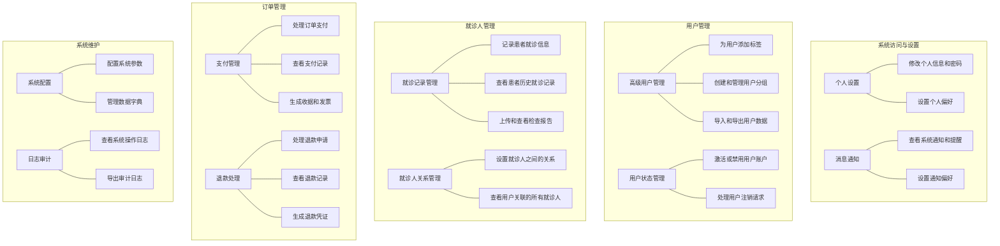
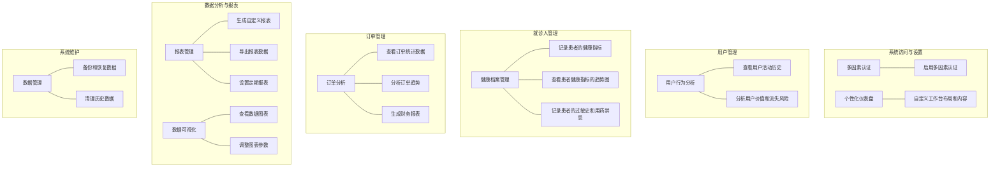
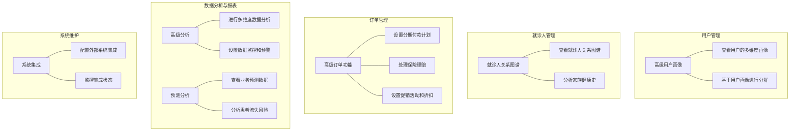

# CRM管理后台系统用户故事地图 (User Story Map)

## 1. 用户故事地图概述

### 1.1 文档目的

本用户故事地图旨在从用户视角出发，系统性地组织和展示MediCRM管理后台系统的用户故事，帮助产品团队理解用户旅程、任务流程和功能优先级，确保产品开发以用户价值为中心。

### 1.2 故事地图结构说明

本用户故事地图采用以下结构：

- **横向维度（用户活动流）**：代表用户使用系统的主要活动序列，从左到右按照时间或逻辑顺序排列
- **纵向维度（任务分解）**：每个主要活动下方，从上到下按照优先级排列具体任务和用户故事
- **版本映射**：用户故事按照发布版本（MVP、v1.0、v1.5等）进行分组，清晰展示每个版本的功能范围

### 1.3 用户角色定义

本故事地图涵盖以下主要用户角色：

1. **医疗机构管理员**：负责系统配置、权限管理和整体运营
2. **前台接待人员**：负责用户和就诊人信息管理、预约安排
3. **医疗财务人员**：负责订单管理、支付处理和财务报表
4. **医疗服务人员**：包括医生、护士等，使用系统查看患者信息

## 2. 用户活动流（横向）

医疗CRM管理后台系统的主要用户活动流如下（从左到右）：

### 2.1 活动流详述

#### 2.1.1 系统访问与设置

用户登录系统，进行个人偏好设置，查看通知和待办事项，设置系统参数等。

#### 2.1.2 用户管理

管理用户账户信息，包括创建、查询、编辑、删除用户，管理用户分组和标签，分析用户行为等。

#### 2.1.3 就诊人管理

管理就诊人信息，包括创建和编辑就诊人档案，记录就诊历史，管理健康档案，处理就诊人关系等。

#### 2.1.4 订单管理

处理医疗服务订单，包括创建订单，处理支付，管理退款，生成发票，查看订单统计等。

#### 2.1.5 数据分析与报表

查看运营数据，生成各类报表，分析业务趋势，导出数据等。

#### 2.1.6 系统维护

管理系统配置，处理日志审计，进行数据备份和恢复，管理角色权限等。

## 3. 用户任务分解（纵向）

### 3.1 系统访问与设置

#### 骨架层（必要任务）

1. **登录系统**
   - 作为系统用户，我需要通过账号密码登录系统，以便开始工作
   - 作为系统用户，我需要在忘记密码时能够重置密码，以便重新获得系统访问权限

2. **查看工作台**
   - 作为系统用户，我需要在登录后看到个性化的工作台，以便快速了解工作状态和待办事项

#### 肌肉层（重要任务）

3. **个人设置**
   - 作为系统用户，我需要修改个人信息和密码，以便保持账户安全和信息准确
   - 作为系统用户，我需要设置个人偏好（如界面主题、通知方式），以便获得更好的使用体验

4. **消息通知**
   - 作为系统用户，我需要查看系统通知和提醒，以便及时了解重要信息
   - 作为系统用户，我需要设置通知偏好，以便控制接收的通知类型和方式

#### 脂肪层（增强任务）

5. **多因素认证**
   - 作为系统用户，我需要启用多因素认证，以提高账户安全性

6. **个性化仪表盘**
   - 作为系统用户，我需要自定义工作台布局和内容，以便更高效地工作

### 3.2 用户管理

#### 骨架层（必要任务）

1. **基础用户管理**
   - 作为前台接待人员，我需要创建新用户账户，以便记录患者信息
   - 作为前台接待人员，我需要查询和编辑用户信息，以便保持信息准确性
   - 作为前台接待人员，我需要查看用户列表，以便快速找到特定用户

#### 肌肉层（重要任务）

2. **高级用户管理**
   - 作为医疗机构管理员，我需要为用户添加标签，以便更好地分类和管理用户
   - 作为医疗机构管理员，我需要创建和管理用户分组，以便进行批量操作和精准营销
   - 作为医疗机构管理员，我需要导入和导出用户数据，以便与其他系统交换数据

3. **用户状态管理**
   - 作为医疗机构管理员，我需要激活或禁用用户账户，以便控制系统访问权限
   - 作为医疗机构管理员，我需要处理用户注销请求，以便遵守数据隐私法规

#### 脂肪层（增强任务）

4. **用户行为分析**
   - 作为医疗机构管理员，我需要查看用户活动历史，以便了解用户行为模式
   - 作为医疗机构管理员，我需要分析用户价值和流失风险，以便制定相应的运营策略

5. **高级用户画像**
   - 作为医疗机构管理员，我需要查看用户的多维度画像，以便提供个性化服务
   - 作为医疗机构管理员，我需要基于用户画像进行分群，以便实施精准营销

### 3.3 就诊人管理

#### 骨架层（必要任务）

1. **基础就诊人管理**
   - 作为前台接待人员，我需要创建新的就诊人档案，以便记录患者基本信息
   - 作为前台接待人员，我需要查询和编辑就诊人信息，以便保持信息准确性
   - 作为前台接待人员，我需要将就诊人关联到用户账户，以便建立用户与就诊人的关系

#### 肌肉层（重要任务）

2. **就诊记录管理**
   - 作为医疗服务人员，我需要记录患者就诊信息，以便跟踪治疗过程
   - 作为医疗服务人员，我需要查看患者历史就诊记录，以便了解患者病史
   - 作为医疗服务人员，我需要上传和查看检查报告，以便进行诊断和治疗

3. **就诊人关系管理**
   - 作为前台接待人员，我需要设置就诊人之间的关系，以便了解家庭成员关系
   - 作为前台接待人员，我需要查看用户关联的所有就诊人，以便提供家庭服务

#### 脂肪层（增强任务）

4. **健康档案管理**
   - 作为医疗服务人员，我需要记录患者的健康指标，以便监测健康状况
   - 作为医疗服务人员，我需要查看患者健康指标的趋势图，以便评估治疗效果
   - 作为医疗服务人员，我需要记录患者的过敏史和用药禁忌，以便避免医疗风险

5. **就诊人关系图谱**
   - 作为医疗机构管理员，我需要查看就诊人关系图谱，以便了解复杂的家庭关系
   - 作为医疗服务人员，我需要分析家族健康史，以便评估遗传风险

### 3.4 订单管理

#### 骨架层（必要任务）

1. **基础订单管理**
   - 作为前台接待人员，我需要创建新订单，以便记录患者所需的医疗服务
   - 作为前台接待人员，我需要查询和编辑订单信息，以便保持信息准确性
   - 作为前台接待人员，我需要更新订单状态，以便跟踪订单进展

#### 肌肉层（重要任务）

2. **支付管理**
   - 作为医疗财务人员，我需要处理订单支付，以便完成交易
   - 作为医疗财务人员，我需要查看支付记录，以便核对账目
   - 作为医疗财务人员，我需要生成收据和发票，以便提供给患者

3. **退款处理**
   - 作为医疗财务人员，我需要处理退款申请，以便解决患者问题
   - 作为医疗财务人员，我需要查看退款记录，以便核对账目
   - 作为医疗财务人员，我需要生成退款凭证，以便提供给患者

#### 脂肪层（增强任务）

4. **订单分析**
   - 作为医疗机构管理员，我需要查看订单统计数据，以便了解业务情况
   - 作为医疗机构管理员，我需要分析订单趋势，以便制定经营策略
   - 作为医疗财务人员，我需要生成财务报表，以便进行财务分析

5. **高级订单功能**
   - 作为医疗财务人员，我需要设置分期付款计划，以便满足患者的支付需求
   - 作为医疗财务人员，我需要处理保险理赔，以便减轻患者负担
   - 作为医疗机构管理员，我需要设置促销活动和折扣，以便吸引更多患者

### 3.5 数据分析与报表

#### 骨架层（必要任务）

1. **基础数据查看**
   - 作为医疗机构管理员，我需要查看关键业务指标，以便了解运营状况
   - 作为医疗机构管理员，我需要查看预设报表，以便获取常规业务数据

#### 肌肉层（重要任务）

2. **报表管理**
   - 作为医疗机构管理员，我需要生成自定义报表，以便满足特定分析需求
   - 作为医疗财务人员，我需要导出报表数据，以便进行进一步分析
   - 作为医疗机构管理员，我需要设置定期报表，以便自动接收业务数据

3. **数据可视化**
   - 作为医疗机构管理员，我需要查看数据图表，以便直观了解业务趋势
   - 作为医疗机构管理员，我需要调整图表参数，以便从不同角度分析数据

#### 脂肪层（增强任务）

4. **高级分析**
   - 作为医疗机构管理员，我需要进行多维度数据分析，以便发现业务洞察
   - 作为医疗机构管理员，我需要设置数据监控和预警，以便及时发现异常

5. **预测分析**
   - 作为医疗机构管理员，我需要查看业务预测数据，以便提前做好资源规划
   - 作为医疗机构管理员，我需要分析患者流失风险，以便采取挽留措施

### 3.6 系统维护

#### 骨架层（必要任务）

1. **权限管理**
   - 作为医疗机构管理员，我需要创建和管理用户角色，以便控制系统访问权限
   - 作为医疗机构管理员，我需要分配用户权限，以便确保数据安全

#### 肌肉层（重要任务）

2. **系统配置**
   - 作为医疗机构管理员，我需要配置系统参数，以便适应业务需求
   - 作为医疗机构管理员，我需要管理数据字典，以便统一数据标准

3. **日志审计**
   - 作为医疗机构管理员，我需要查看系统操作日志，以便追踪用户活动
   - 作为医疗机构管理员，我需要导出审计日志，以便进行合规检查

#### 脂肪层（增强任务）

4. **数据管理**
   - 作为医疗机构管理员，我需要备份和恢复数据，以便防止数据丢失
   - 作为医疗机构管理员，我需要清理历史数据，以便优化系统性能

5. **系统集成**
   - 作为医疗机构管理员，我需要配置外部系统集成，以便实现数据互通
   - 作为医疗机构管理员，我需要监控集成状态，以便确保系统正常运行

## 4. 故事优先级与版本映射

### 4.1 版本映射总览

下表展示了各个用户故事与产品版本的映射关系：

| 活动 | 任务 | 用户故事 | 版本 |
| --- | --- | --- | --- |
| **系统访问与设置** | 登录系统 | 账号密码登录 | MVP |
| | | 密码重置 | MVP |
| | 查看工作台 | 查看个性化工作台 | MVP |
| | 个人设置 | 修改个人信息和密码 | v1.0 |
| | | 设置个人偏好 | v1.0 |
| | 消息通知 | 查看系统通知和提醒 | v1.0 |
| | | 设置通知偏好 | v1.0 |
| | 多因素认证 | 启用多因素认证 | v1.5 |
| | 个性化仪表盘 | 自定义工作台布局和内容 | v1.5 |
| **用户管理** | 基础用户管理 | 创建新用户账户 | MVP |
| | | 查询和编辑用户信息 | MVP |
| | | 查看用户列表 | MVP |
| | 高级用户管理 | 为用户添加标签 | v1.0 |
| | | 创建和管理用户分组 | v1.0 |
| | | 导入和导出用户数据 | v1.0 |
| | 用户状态管理 | 激活或禁用用户账户 | v1.0 |
| | | 处理用户注销请求 | v1.0 |
| | 用户行为分析 | 查看用户活动历史 | v1.5 |
| | | 分析用户价值和流失风险 | v1.5 |
| | 高级用户画像 | 查看用户的多维度画像 | v2.0 |
| | | 基于用户画像进行分群 | v2.0 |
| **就诊人管理** | 基础就诊人管理 | 创建新的就诊人档案 | MVP |
| | | 查询和编辑就诊人信息 | MVP |
| | | 将就诊人关联到用户账户 | MVP |
| | 就诊记录管理 | 记录患者就诊信息 | v1.0 |
| | | 查看患者历史就诊记录 | v1.0 |
| | | 上传和查看检查报告 | v1.0 |
| | 就诊人关系管理 | 设置就诊人之间的关系 | v1.0 |
| | | 查看用户关联的所有就诊人 | v1.0 |
| | 健康档案管理 | 记录患者的健康指标 | v1.5 |
| | | 查看患者健康指标的趋势图 | v1.5 |
| | | 记录患者的过敏史和用药禁忌 | v1.5 |
| | 就诊人关系图谱 | 查看就诊人关系图谱 | v2.0 |
| | | 分析家族健康史 | v2.0 |
| **订单管理** | 基础订单管理 | 创建新订单 | MVP |
| | | 查询和编辑订单信息 | MVP |
| | | 更新订单状态 | MVP |
| | 支付管理 | 处理订单支付 | v1.0 |
| | | 查看支付记录 | v1.0 |
| | | 生成收据和发票 | v1.0 |
| | 退款处理 | 处理退款申请 | v1.0 |
| | | 查看退款记录 | v1.0 |
| | | 生成退款凭证 | v1.0 |
| | 订单分析 | 查看订单统计数据 | v1.5 |
| | | 分析订单趋势 | v1.5 |
| | | 生成财务报表 | v1.5 |
| | 高级订单功能 | 设置分期付款计划 | v2.0 |
| | | 处理保险理赔 | v2.0 |
| | | 设置促销活动和折扣 | v2.0 |
| **数据分析与报表** | 基础数据查看 | 查看关键业务指标 | MVP |
| | | 查看预设报表 | MVP |
| | 报表管理 | 生成自定义报表 | v1.5 |
| | | 导出报表数据 | v1.5 |
| | | 设置定期报表 | v1.5 |
| | 数据可视化 | 查看数据图表 | v1.5 |
| | | 调整图表参数 | v1.5 |
| | 高级分析 | 进行多维度数据分析 | v2.0 |
| | | 设置数据监控和预警 | v2.0 |
| | 预测分析 | 查看业务预测数据 | v2.0 |
| | | 分析患者流失风险 | v2.0 |
| **系统维护** | 权限管理 | 创建和管理用户角色 | MVP |
| | | 分配用户权限 | MVP |
| | 系统配置 | 配置系统参数 | v1.0 |
| | | 管理数据字典 | v1.0 |
| | 日志审计 | 查看系统操作日志 | v1.0 |
| | | 导出审计日志 | v1.0 |
| | 数据管理 | 备份和恢复数据 | v1.5 |
| | | 清理历史数据 | v1.5 |
| | 系统集成 | 配置外部系统集成 | v2.0 |
| | | 监控集成状态 | v2.0 |

### 4.2 MVP版本用户故事地图

### 4.3 v1.0版本新增用户故事

### 4.4 v1.5版本新增用户故事

### 4.5 v2.0版本新增用户故事

## 5. 用户故事优先级评估标准

### 5.1 优先级评估维度

在确定用户故事优先级时，我们考虑以下维度：

1. **业务价值**：该功能对业务目标的贡献程度
2. **用户需求**：用户对该功能的需求程度和频率
3. **技术复杂度**：实现该功能的技术难度和工作量
4. **依赖关系**：与其他功能的依赖关系
5. **风险因素**：实现该功能可能面临的风险

### 5.2 优先级评分方法

我们使用以下方法对用户故事进行优先级评分：

1. **业务价值**：1-5分，5分表示价值最高
2. **用户需求**：1-5分，5分表示需求最强烈
3. **技术复杂度**：1-5分，1分表示最复杂（需要更多资源）
4. **依赖关系**：1-5分，1分表示依赖性最强（需要先完成其他功能）
5. **风险因素**：1-5分，1分表示风险最高

**总分计算**：业务价值 × 2 + 用户需求 × 2 + 技术复杂度 + 依赖关系 + 风险因素

**优先级划分**：
- 高优先级（P0）：总分 ≥ 35
- 中优先级（P1）：总分 25-34
- 低优先级（P2）：总分 < 25

## 6. 用户故事地图维护与更新

### 6.1 更新机制

本用户故事地图将根据以下情况进行更新：

1. 产品需求变更
2. 用户反馈和新洞察
3. 技术条件变化
4. 市场环境变化
5. 每个版本发布后的回顾与总结

### 6.2 更新流程

1. 收集新的用户需求和反馈
2. 评估需求的优先级和可行性
3. 更新用户故事地图
4. 与产品团队评审更新后的地图
5. 调整产品路线图和开发计划

### 6.3 版本控制

用户故事地图的版本控制与产品版本保持一致，每次重大更新后，地图版本号增加0.1。